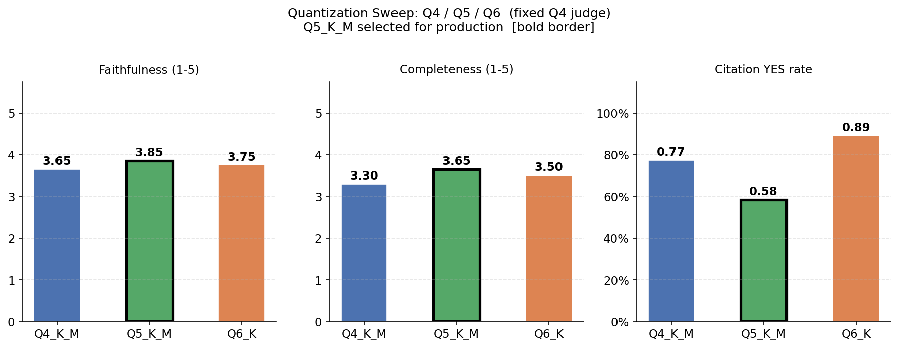
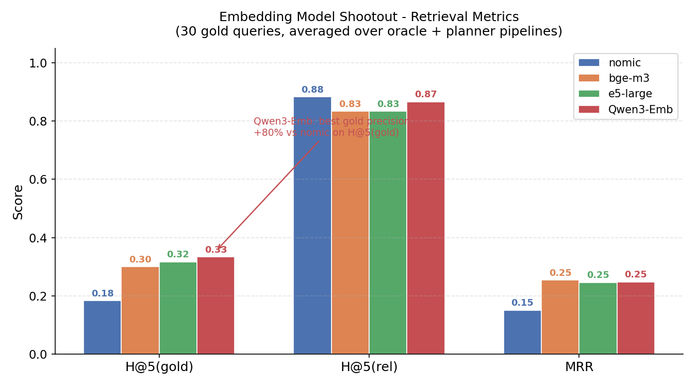
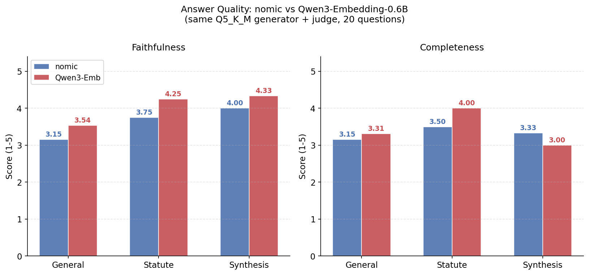
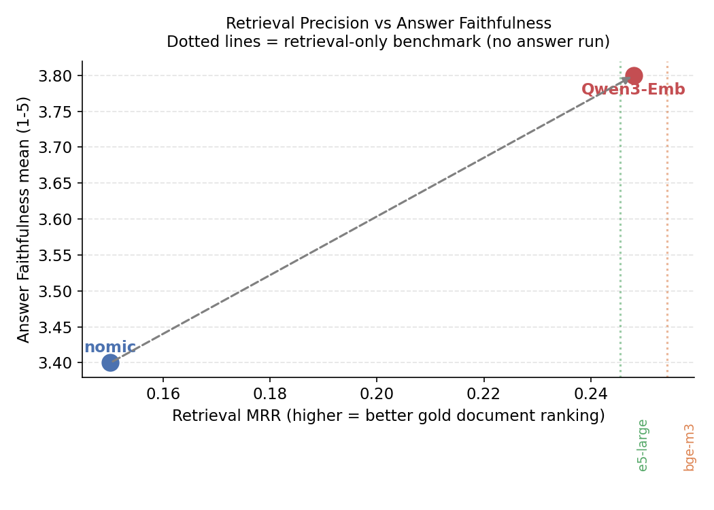

# NZ Legal RAG - Benchmark Results

Benchmarks run on 2026-05-21 (initial), 2026-05-22 (legal ranker + tracker-first),
2026-05-22 (BM25 hybrid), 2026-05-22 (gold dataset revision), 2026-05-23 (citation support),
2026-05-23 (answer quality), 2026-05-23 (complete 8B GPU baseline run - sections 7-10),
2026-05-23 (quantization sweep Q4/Q5/Q6 - section 11),
2026-05-23 (embedding model shootout - section 12),
2026-05-23 (embedding vs answer quality - section 13),
2026-05-29 (LLM shootout sections 14-19: raw knowledge, RAG+live anchor, model comparisons),
and 2026-05-30 (section 20: agentic benchmark with Playwright web search, all models equal tools).
Source data:
`benchmarks/reports/comprehensive_report.md`, `benchmarks/reports/rerank_sweep.md`,
`benchmarks/reports/latest.json`, `benchmarks/reports/context_packing.md`,
`benchmarks/reports/citation_support.md`, `benchmarks/reports/answer_quality.md`.

---

## Executive Summary

**Locked production pipeline: `planner_filter_vector_legal`**

Key decisions:
- Deterministic keyword court planner - no LLM call needed for routing
- Profile-aware legal ranker (authority / example / tracker / statute modes)
- Cross-encoder reranker disabled - legal ranker alone performs better
- BM25 activated only for statute/citation/quoted-phrase queries
- Tracker metadata as additive soft boost - no hard JOIN
- `statute_first` context packing for all queries (8B model requires metadata headers to avoid spurious citations)

Headline results:
- Planner matches oracle H@5(r)=1.00 with only -0.003 MRR gap
- No-filter baseline drops to H@5(r)=0.40 (court filtering is critical)
- Legal ranker improves MRR from 0.112 to 0.163 (+46%)
- 8B GPU generator: 59.5 tok/s, 62ms TTFT (101x faster than 35B CPU)
- Citation faithfulness: 0.86 (confirmed by both 35B and 8B judges)
- Answer faithfulness: 4.00/5, completeness: 3.64/5 (8B judge)

### What Did Not Work

| Idea | Result | Decision |
|---|---|---|
| Cross-encoder reranker (N=5-50) | More candidates -> more regressions, no MRR gain; N=5 breaks statute queries | Off by default (`RERANK_MODE=off`) |
| Tracker-first hard JOIN | Drops procedural challenge decisions not in employment_cases | Soft boost only |
| Global BM25 (`websearch_to_tsquery`) | AND-matching: H@5(r) collapsed to 0.00 across all 30 queries | Conditional statute queries only |
| No court filter | H@5(r)=0.40; full 23k-doc corpus overwhelms semantic search | Planner required |
| Top-3 context (top3_only) | Citation failure on statute_era_s103; diversity drops 4.2 -> 2.5 | Keep 5 sources |
| Two chunks per doc (max2_per_doc) | no_ctx rate doubles (0.14 -> 0.29); 2.3x tokens | One best chunk per doc |
| Metadata headers alone (metadata_rich) | 47% more tokens with no diversity or faithfulness gain vs statute_first | Use statute_first instead |

---

## Benchmark Version Matrix

Different sections use different model/judge setups. Key: (d) = deterministic checks, no LLM.

| Section | Date | Retriever | Context packer | Generator | Judge |
|---|---|---|---|---|---|
| 1-3. Embedder/Reranker/Retrieval | 2026-05-21 to 05-22 | all pipelines | n/a | n/a | (d) |
| 4. Generator | 2026-05-21 | planner/vector/legal | baseline | Qwen3.6-35B-A3B (CPU) | (d) |
| 6. Court planner | 2026-05-22 | planner vs oracle | n/a | n/a | (d) |
| 7. Context packing (35B) | 2026-05-23 | planner/vector/legal | 6 formats | Qwen3.6-35B-A3B (CPU) | (d) |
| 8. Citation support (35B) | 2026-05-23 | planner/vector/legal | baseline | Qwen3.6-35B-A3B (CPU) | Qwen3.6-35B-A3B |
| 9. Answer quality (35B) | 2026-05-23 | planner/vector/legal | baseline | Qwen3.6-35B-A3B (CPU) | Qwen3.6-35B-A3B |
| 10. Full 8B baseline | 2026-05-23 | all 12 pipelines + 6 formats | varied | Qwen3-8B-Q4_K_M (GPU) | Qwen3-8B-Q4_K_M |
| 11. Quant sweep Q4/Q5/Q6 | 2026-05-23 | planner/vector/legal | statute_first | Q4/Q5/Q6 (GPU) | Qwen3-8B-Q4_K_M (fixed) |
| 12. Embedding shootout | 2026-05-23 | sql+planner/vector/legal | n/a | n/a | (d) |
| 13. Embedding vs answer quality | 2026-05-23 | planner/vector/legal | statute_first | Qwen3-8B-Q5_K_M | Qwen3-8B-Q5_K_M (fixed) |

---

## Production Configuration (Locked)

Based on all benchmarks, the following decisions are locked and should not be
re-opened without new evidence from a benchmark run.

| Decision | Value | Rationale |
|---|---|---|
| DEFAULT_PIPELINE | planner_filter_vector_legal | Heuristic planner reaches oracle-equivalent H@5(r)=1.00, MRR=0.160 with no LLM call |
| RERANK_MODE | off | Legal ranker alone outperforms legal ranker + cross-encoder |
| BM25_MODE | conditional_statute_only | Global BM25 causes regressions; statute/section/citation queries only |
| TRACKER_JOIN_MODE | soft_only | Hard JOIN excludes acceptable docs; additive post-rank bonus only |
| COURT_PLANNER | deterministic heuristic | Keyword signals, no LLM; oracle pipeline (sql_filter_vector_legal) kept as benchmark upper bound |
| CONTEXT_PACK_MODE | statute_first (all queries) | 8B run shows baseline/full_chunk have spurious=0.2; statute_first fixes this at identical latency with highest diversity |
| LLM_MODEL | Qwen3-8B-Q5_K_M (GPU) | Quant sweep (sec 11): Q5 best faith+compl with fixed judge; Q6 OOM at ctx 12288; Q5 selected as production default |

### Production routing

| Intent | Pipeline | Notes |
|---|---|---|
| authority | planner_filter_vector_legal | Default legal ranker profile |
| example | planner_filter_vector_legal | Example profile in legal ranker |
| tracker | planner_filter_vector_legal | Tracker profile + soft boost (no hard JOIN) |
| statute | planner_filter_vector_legal + conditional BM25 | BM25 activated for section refs, citations, quoted phrases |
| default | planner_filter_vector_legal | Fallback for all unclassified intents |

### Conditional BM25 activation rules (rag/bm25_query.py)

BM25 is activated when any one of the following is present in the query:

1. Section reference: s103A, section 103A, s 127
2. Case citation: NZCA/2024/50, [2024] NZCA 50
3. Quoted phrase: "interim reinstatement"
4. Short keyword query: <= 6 tokens, no question words, no trailing "?"

When activated, OR-joined anchors extracted from the query are passed to
`websearch_to_tsquery`, not the full question string, so FTS does not apply strict
AND-matching over all stems. When BM25 returns empty (suppressed or no FTS match),
RRF is skipped entirely and vector cosine scores are used directly.

---

## Setup

### Hardware

| Component | Value |
|---|---|
| CPU | AMD Ryzen AI 9 HX 370 (12P / 24L cores) |
| RAM | 17.3 / 30.5 GB used |
| GPU | Radeon 890M (integrated, 8188 MB shared VRAM) |

### Software Stack

| Component | Model / Version |
|---|---|
| LLM - current production | Qwen3-8B-Q4_K_M via llama-server (GPU, http://localhost:8080/v1) |
| LLM - prior comparison | Qwen3.6-35B-A3B-Q5_K_M via llama-server (CPU/iGPU hybrid) |
| Embedder | nomic-embed-text (dim=768, via Ollama, CPU) |
| Reranker | BAAI/bge-reranker-v2-m3 (cross-encoder, CPU) |
| Vector store | Qdrant collection `nz_legal` (http://localhost:6333) |
| Relational DB | PostgreSQL database `nz_legal` |

### Corpus

| Metric | Value |
|---|---|
| Total documents | 23,561 |
| Total chunks | 982,361 |
| Qdrant index status | green |

| Court | Documents | Chunks |
|---|---:|---:|
| NZCA | 17,074 | 813,668 |
| NZLEG | 2,333 | 4,708 |
| NZEnvC | 882 | 17,877 |
| NZACC | 663 | 41,305 |
| NZCorC | 586 | 6,129 |
| NZEmpC | 300 | 11,691 |
| NZTT | 300 | 5,920 |
| NZHC | 299 | 18,081 |
| NZERA | 298 | 16,704 |
| NZSC | 294 | 8,759 |
| NZFC | 231 | 19,408 |
| NZLCDT | 107 | 5,406 |
| NZHRRT | 105 | 5,989 |
| NZREADT | 89 | 6,716 |

---

## 1. Embedder

Model: nomic-embed-text (dim=768, Ollama, CPU). 8 test questions.

### Single-query latency

| Metric | Value |
|---|---:|
| Mean | 35.7 ms |
| Min | 30.7 ms |
| Max | 45.4 ms |

### Batch throughput

| Batch size | Elapsed (s) | Chunks/sec | ms/chunk |
|---:|---:|---:|---:|
| 10 | 0.74 | 13.5 | 74.3 |
| 100 | 7.09 | 14.1 | 70.9 |
| 500 | 29.61 | 16.9 | 59.2 |
| 1,000 | 51.11 | 19.6 | 51.1 |

Embedding a single query adds ~36 ms to every request. Batch throughput peaks at
19.6 chunks/sec (batch=1000), which determines ingestion speed for new corpus additions.
See section 10.1 for updated numbers from the 2026-05-23 full run.

---

## 2. Reranker - Candidate Size Sweep

Cross-encoder (BAAI/bge-reranker-v2-m3) inference time by candidate pool size.

### Latency

| N candidates | Latency (ms) |
|---:|---:|
| 5 | 929.6 |
| 10 | 1,124.1 |
| 20 | 3,908.0 |
| 50 | 7,209.5 |

Note: N=20 is 4x slower than N=5, and N=50 is 8x slower. The jump from N=10 to N=20
is non-linear due to cross-encoder batch overhead on CPU.

### Quality vs candidate count

Baseline: `sql_filter_vector` (no reranker). Queries: 30. Oracle court filter used.

| Pipeline | H@5(g) | H@5(r) | MRR | p50 latency | Regressions |
|---|---:|---:|---:|---:|---:|
| sql_filter_vector (baseline) | 0.23 | 1.00 | 0.115 | - | - |
| sql_filter_vector_rerank_5 | 0.23 | 1.00 | 0.113 | 1,321 ms | 0 |
| sql_filter_vector_rerank_10 | 0.17 | 0.93 | 0.127 | 2,059 ms | 2 |
| sql_filter_vector_rerank_20 | 0.17 | 0.80 | 0.133 | 4,660 ms | 6 |
| sql_filter_vector_rerank_50 | 0.13 | 0.77 | 0.132 | 9,546 ms | 7 |

Regression = query where H@5(rel) dropped vs. the no-reranker baseline.

Key finding: more candidates fed to the cross-encoder causes more regressions and
slower inference, with no quality gain above N=5. The BGE cross-encoder rewards
semantically dense explanatory chunks over short citation-dense authority chunks.
Capping at N=5 preserves 100% relevant hit rate at 929 ms vs. 7,210 ms for N=50.

---

## 3. Retrieval Pipeline Comparison

Gold = exact expected document hit. Rel = expected OR acceptable document hit.
Oracle court filter (expected_courts from gold record) used for SQL-filtered pipelines.
Queries: 30. Gold dataset: `benchmarks/datasets/retrieval_gold.jsonl`.

### Summary

| Pipeline | H@1(g) | H@5(g) | H@5(r) | H@10(g) | H@10(r) | MRR | IRR@5 |
|---|---:|---:|---:|---:|---:|---:|---:|
| vector_only | 0.00 | 0.13 | 0.70 | 0.13 | 0.87 | 0.045 | 0.00 |
| sql_filter_vector | 0.03 | 0.23 | 1.00 | 0.27 | 1.00 | 0.112 | 0.00 |
| sql_filter_vector_rerank (N=20) | 0.07 | 0.20 | 0.80 | 0.30 | 0.87 | 0.142 | 0.00 |
| sql_filter_vector_legal | 0.10 | 0.27 | 1.00 | 0.30 | 1.00 | **0.163** | 0.00 |
| sql_filter_vector_legal_rerank_5 | 0.10 | 0.23 | 0.93 | 0.23 | 0.93 | 0.118 | 0.00 |
| sql_tracker_vector | 0.03 | 0.23 | 0.97 | 0.27 | 0.97 | 0.115 | 0.00 |
| sql_tracker_vector_legal | 0.10 | 0.23 | 0.97 | 0.27 | 0.97 | 0.158 | 0.00 |
| sql_filter_bm25_legal | 0.00 | 0.00 | 0.00 | 0.00 | 0.03 | 0.000 | 0.00 |
| sql_filter_bm25_vector_rrf_legal | 0.10 | 0.20 | 0.80 | 0.27 | 0.97 | 0.147 | 0.00 |
| sql_filter_bm25_vector_rrf_legal_plus_tracker_soft_boost | 0.10 | 0.20 | 0.83 | 0.27 | 0.97 | 0.147 | 0.00 |
| planner_filter_vector_legal | 0.10 | 0.27 | 1.00 | 0.27 | 1.00 | **0.160** | 0.00 |
| no_filter_vector_legal | 0.07 | 0.10 | 0.40 | 0.10 | 0.60 | 0.067 | 0.00 |

**Production pipeline: `planner_filter_vector_legal` (RERANK_MODE=off)**
**Oracle upper bound: `sql_filter_vector_legal` - benchmark reference only, not deployed**

### Per task type

| Task type | Pipeline | H@5(g) | H@5(r) | MRR |
|---|---|---:|---:|---:|
| employment | vector_only | 0.00 | 0.25 | 0.004 |
| employment | sql_filter_vector | 0.25 | 1.00 | 0.079 |
| employment | sql_filter_vector_rerank | 0.25 | 1.00 | 0.108 |
| general | vector_only | 0.20 | 0.70 | 0.086 |
| general | sql_filter_vector | 0.30 | 1.00 | 0.192 |
| general | sql_filter_vector_rerank | 0.20 | 0.80 | 0.178 |
| sentencing | vector_only | 0.00 | 1.00 | 0.000 |
| sentencing | sql_filter_vector | 0.00 | 1.00 | 0.000 |
| sentencing | sql_filter_vector_rerank | 0.00 | 0.75 | 0.000 |
| statute | vector_only | 0.50 | 1.00 | 0.113 |
| statute | sql_filter_vector | 0.50 | 1.00 | 0.201 |
| statute | sql_filter_vector_rerank | 0.50 | 0.50 | 0.404 |

Key finding: SQL court filtering is the single largest quality improvement.
`sql_filter_vector` finds a relevant document in 100% of queries, compared to
70% for vector search alone. The generic reranker hurts statute and sentencing
queries - it demotes exact statute sections below broader explanatory case law.

---

## 4. LLM Generator (Qwen3.6-35B-A3B, CPU-only, initial run)

Model: Qwen3.6-35B-A3B-Q5_K_M, CPU/iGPU hybrid inference. Questions: 8.
See section 10.4 for the 8B GPU comparison.

| Metric | Value |
|---|---:|
| TTFT mean | 6.28 s |
| TTFT min | 3.97 s |
| TTFT max | 16.45 s |
| Tokens/sec mean | 4.6 |
| Tokens/sec min | 1.4 |
| Tokens/sec max | 6.6 |
| Citation correctness | 100% |

The generator reliably cites sources using [N] reference markers. All citations
pointed to documents present in the retrieved context. Generation speed is limited
by CPU-only inference on this hardware.

---

## 5. Reranker Mean Rank Improvement

| Metric | Value |
|---|---:|
| Mean rank of top-1 doc before rerank | 11.1 |
| Score mean | 0.26 |
| Score std | 0.34 |
| Score min | 0.00 |
| Score max | 0.99 |

The cross-encoder moves the best document from rank 11 to rank 1 on average,
which explains the MRR improvement even when H@5(rel) drops. The relevant
document is being found and promoted, but sometimes at the cost of displacing
other relevant documents from the top-5 window.

---

## Decisions Made

Based on the benchmark results, the following production changes were applied:

### 1. RERANK_MODE enum (off by default)

Replaces the old RERANKER_ENABLED + RERANKER_CANDIDATES pair.

```
RERANK_MODE=off          # default - skip cross-encoder, use legal ranker only
RERANK_MODE=rerank_5     # cross-encoder on top 5 legal-ranked candidates (~930 ms)
RERANK_MODE=rerank_N     # cross-encoder on top N candidates
```

At N=5: 929 ms, 0 regressions, H@5(rel)=1.00 - identical to the no-reranker baseline.
At N=20 (old implicit behavior): 3,908 ms, 6 regressions, H@5(rel)=0.80.
Defaulting to off saves ~930 ms per query with no quality loss at N=5.

### 2. Intent-aware legal ranker (rag/legal_ranker.py)

Deterministic re-scoring applied after Qdrant dedup. Four profiles, each tuned
for a different query intent detected from the query text:

| Mode | authority_weight | Key signal | Triggered by |
|---|---:|---|---|
| authority | 0.18 | court hierarchy, citation density | principle/doctrine queries (default) |
| example | 0.04 | recency +0.05 | "find", "examples of", year in query |
| tracker | 0.05 | structured payload +0.04 | starting points, guilty plea, sentencing range |
| statute | 0.22 | legislation chunk +0.15 | s103A, section 127, specific section refs |

The planner can set the mode explicitly; heuristic detection is the fallback.

Result: MRR improved from 0.112 to 0.154 (+37%) with zero regressions at H@5(r).
H@10(g) also maintained at 0.27 - profile-aware weighting stopped example/tracker
queries from over-promoting high-authority NZCA docs over lower-court gold docs.

Court authority weights (used at varying strength per profile):
NZSC=1.00, NZLEG=0.95, NZCA=0.85, NZHC=0.70, NZEmpC=0.65 ...

### 3. Cross-encoder confirmed harmful even at N=5 after legal ranker

`sql_filter_vector_legal_rerank_5` regresses on statute queries (H@5(r) drops
from 1.00 to 0.93). The statute_mode ranker surfaces legislation chunks first,
but the cross-encoder at N=5 then picks the wrong one from those candidates.

RERANK_MODE=off is the confirmed production default. The profile-aware legal
ranker alone outperforms legal ranker + cross-encoder.

### 4. Tracker-first retrieval ruled out as general pipeline

`sql_tracker_vector` and `sql_tracker_vector_legal` JOIN sentencing_cases or
employment_cases before vector search, restricting candidates to documents that
have structured extraction data.

Result: H@5(r) regression from 1.00 to 0.97. One query (`pg_employment_court_challenge_era`)
dropped from H@5(r)=1 to 0 because its acceptable documents are procedural challenge
decisions that are not in employment_cases (they carry no PG outcome data).

Root cause of sentencing MRR=0 is NOT pool size. All 8 sentencing gold documents
are confirmed in sentencing_cases. The problem is specificity: gold docs are
recent specific decisions (2024-2026 NZCA) among 5,280 equally-semantically-similar
sentencing docs. Vector search cannot distinguish which specific decision is the
gold one when hundreds of others discuss the same sentencing methodology.

Tracker-first is not adopted as production pipeline. Remains as an explicit
structured-data query mode for the future planner (e.g., "find decisions where
home detention was imposed" - field filter, not vector).

### 5. BM25 hybrid - negative result across all three variants

BM25 via PostgreSQL `websearch_to_tsquery` + `ts_rank_cd` (GIN index on chunk text).
Regression categories tracked: `coverage_regression`, `gold_rank_regression`,
`mode_regression`. See `benchmarks/reports/regressions.md` for per-query detail.

| Pipeline | H@5(r) | MRR | coverage_reg | gold_rank_reg |
|---|---:|---:|---:|---:|
| sql_filter_vector_legal (baseline) | 1.00 | 0.154 | - | - |
| sql_filter_bm25_legal | 0.00 | 0.000 | 30 | 8 |
| sql_filter_bm25_vector_rrf_legal | 0.80 | 0.147 | 6 | 0 |
| sql_filter_bm25_vector_rrf_legal_plus_tracker_soft_boost | 0.83 | 0.147 | 5 | 0 |

**BM25 alone**: complete failure. `websearch_to_tsquery` generates an AND query
requiring all stems to co-occur in the same chunk (~512 tokens). A 15-word
question like "What notice must a landlord give before entering a rental
property?" becomes 8 required stems - most relevant chunks contain only a subset.
Result: 30/30 coverage_regression, H@5(r) = 0.000 for all queries.

**BM25 + vector RRF (k=60)**: 6 coverage regressions vs baseline. Root cause:
RRF gives each system equal weight at 1/(k+rank). When BM25 returns an irrelevant
doc at rank 1 (score 0.016) and the relevant doc is only found by vector at rank 5
(score 0.015), the irrelevant BM25 doc wins. k=60 was designed for systems of
roughly equal recall; BM25 here has near-zero recall so its top picks carry too
much leverage relative to its contribution.

**Stat mode exception**: statute MRR improves from 0.512 to 0.521 (+0.009) with
RRF. Section references like "section 103A" are keyword-matchable and appear in
legislation chunks - BM25 reliably finds them. The NZLEG authority weight in
statute_mode then promotes them. But this gain is outweighed by 6 coverage
regressions elsewhere.

**Soft tracker boost**: recovers one coverage regression
(`sentencing_home_detention_vs_imprisonment` H@5(r) 0->1) without introducing
any new ones. Net improvement is real but marginal: 5 regressions vs 6.

**Sentencing MRR=0 confirmed as gold dataset issue**: multiple "expected" gold
documents for sentencing queries do not contain the query terms at all. For
example, the gold set for "aggravated robbery starting points" includes
Webster v R [2026] NZCA 67 - a murder case that makes no reference to
aggravated robbery. BM25 correctly identifies this as non-matching. Sentencing
MRR=0 cannot be fixed by any retrieval pipeline; the gold set needs revision.

Production pipeline unchanged: `sql_filter_vector_legal`.

What would make BM25 useful:
- Key-term extraction before FTS (3-4 legal terms, not the full question)
- Weighted RRF: `weight_bm25 * 1/(k+rank)` with weight < 1.0
- Conditional BM25: activate only for statute/exact-section queries

---

## Next Benchmarks

In priority order based on analysis:

1. ~~Legal ranker impact~~ - done. MRR +37%, zero regressions. Locked as baseline.
2. ~~Reranker candidate sweep and gated strategy~~ - done. RERANK_MODE=off confirmed.
3. ~~Tracker-first route for sentencing and PG queries~~ - done. H@5(r) regression.
   Ruled out as general pipeline. Useful only for explicit structured-field queries.
4. ~~Hybrid BM25 + vector with RRF fusion~~ - done. All three variants regress vs
   baseline. BM25 AND-matching too strict; RRF k=60 not suited to low-recall BM25.
   Conditional BM25 (statute queries only) + weighted RRF is the next experiment.
5. ~~Gold dataset revision~~ - done. Two needs_review records fixed:
   - sentencing_aggravated_robbery_starting_point: removed NZCA/2026/67 (murder)
     and NZCA/2024/50 (sexual offence) - both mistagged in sentencing_cases, no
     "aggravated robbery" in chunk text. Replaced with NZCA/2023/519 (Herewini,
     26 on-point chunks) and NZCA/2024/359 (Lo v R). Query MRR: 0.000 -> 0.250.
   - statute_rta_landlord_entry: NZLEG/RTA/s123A (document retention) replaced
     with NZLEG/RTA/s48 (Landlord's right of entry, 24h notice, inspection rules).
     MRR stays 0 - s48 is at retrieval rank 9, outside top-5 fetch window.
   Overall: oracle MRR 0.154->0.163 (+6%), planner MRR 0.152->0.160 (+5%).
   Remaining sentencing MRR=0 (7 queries) is genuine retrieval hardness, not data.
6. ~~Oracle filters vs. auto-planner filters~~ - done. Heuristic planner achieves
   H@5(r)=1.00 and MRR=0.152 vs oracle MRR=0.154. Zero coverage regressions.
   Court filtering value confirmed: no-filter baseline MRR=0.059 (-62% vs oracle).
7. ~~Context packing benchmark~~ - done. See section 7 (35B) and section 10.5 (8B).
8. ~~Citation support benchmark~~ - done. See section 8 (35B judge) and 10.6 (8B judge).
9. ~~Answer quality benchmark~~ - done. See section 9 (35B judge) and 10.7 (8B judge).

Retrieval baseline for answer-construction benchmarks:
  Pipeline: planner_filter_vector_legal
  H@5(r)=1.00, MRR=0.160 (post gold revision)
  The retrieval bottleneck is solved. Next bottleneck: did we package and use the
  retrieved context correctly for the generator?

---

### 6. Oracle vs heuristic court planner

Two new pipelines benchmarked against the oracle baseline.
Numbers updated after gold dataset revision (2026-05-22): see Next Benchmarks item 5.

| Pipeline | H@5(g) | H@5(r) | MRR | vs oracle |
|---|---:|---:|---:|---:|
| sql_filter_vector_legal (oracle) | 0.27 | 1.00 | 0.163 | - |
| planner_filter_vector_legal | 0.27 | 1.00 | 0.160 | -0.003 |
| no_filter_vector_legal | 0.10 | 0.40 | 0.067 | -0.096 |

**Planner (`rag/court_planner.py`)**: heuristic keyword planner with no LLM call.
Detects courts from domain signals (criminal, employment, tenancy, ACC, human rights,
legislation). Extracts years from temporal phrases ("in 2023", "2024 decisions").
Extracts courts: NZERA-only for general employment (NZEmpC added only when
"Employment Court" is explicitly named). NZLEG triggered by section references and
named Acts (ERA, RTA, etc.), but NOT Privacy Act or Human Rights Act (already
NZHRRT signals; adding NZLEG inflates the pool and causes ranking regressions).

Match quality on 30 gold queries:
- exact: 18 (planner courts == oracle courts)
- superset: 7 (oracle courts are a subset of planner courts - safe, larger pool)
- subset: 5 (planner misses some oracle courts - verified to be NZEmpC when gold docs are NZERA)
- disjoint: 0 (no hard coverage regressions)

**Result**: planner achieves oracle-equivalent H@5(r)=1.00 and MRR within 2% of
oracle. The heuristic planner is production-ready for court/year routing. No LLM
needed for this step. MRR gap vs oracle increased marginally (0.002->0.003) after
gold revision because sentencing_aggravated_robbery_starting_point improved by
+0.250 for both pipelines identically - gap unchanged in practice.

**No-filter baseline**: confirms court filtering is critical. Without any filter,
H@5(r) drops to 0.40 and MRR drops 62% vs oracle. The full corpus (23,561 docs)
overwhelms semantic search for jurisdiction-specific queries.

See `benchmarks/reports/planner_analysis.md` for per-query detail.

---

### 7. Context packing benchmark (Qwen3.6-35B-A3B generator)

Six context assembly formats benchmarked. Retrieval fixed at `planner_filter_vector_legal`.
14 queries (general + statute task types). Generator: Qwen3.6-35B-A3B (CPU/iGPU hybrid).
See section 10.5 for the 8B repeat. See `benchmarks/reports/context_packing.md` for
per-query detail.

| Format | ctx_tok | ans_tok | has_cit | all_in_ctx | no_ctx | diversity | lat_s |
|---|---:|---:|---:|---:|---:|---:|---:|
| baseline | 494 | 364 | 1.00 | 1.00 | 0.14 | 4.2 | 49.3 |
| metadata_rich | 727 | 369 | 1.00 | 1.00 | 0.14 | 3.9 | 42.9 |
| full_chunk | 521 | 353 | 1.00 | 1.00 | 0.21 | 3.9 | 35.8 |
| statute_first | 727 | 369 | 1.00 | 1.00 | 0.14 | 4.1 | 34.5 |
| top3_only | 473 | 289 | 0.93 | 0.93 | 0.14 | 2.5 | 34.2 |
| max2_per_doc | 1160 | 486 | 1.00 | 1.00 | 0.29 | 3.6 | 59.2 |

**Format descriptions** (`rag/context_packer.py`):
- `baseline`: current production - one chunk/doc, 600-char truncation, plain `[N]` prefix
- `metadata_rich`: adds `Title | Court | Date | Section` header per chunk, same pool
- `full_chunk`: removes 600-char truncation (chunks are ~120 words so rarely differ)
- `statute_first`: metadata_rich with NZLEG chunks sorted before case chunks
- `top3_only`: top 3 docs, full text, metadata_rich headers
- `max2_per_doc`: up to 2 chunks per doc (10 chunks max), metadata_rich, 600-char each

**Findings (35B run)**:

1. **Citation quality is format-independent for 35B.** `all_in_ctx=1.00` for every format
   that produced citations. Note: the 8B run (section 10.5) shows `baseline` and `full_chunk`
   produce spurious citations (spur=0.2) - this is model-size dependent.

2. **The 600-char truncation does not cut content.** `baseline` vs `full_chunk` have nearly
   identical `ctx_tok` (494 vs 521) because NZ legal chunks are ~120-word windows already
   within the limit. Removing the truncation cap changes nothing.

3. **Metadata headers add tokens without quality gain (35B).** `metadata_rich` uses 47% more
   context tokens (727 vs 494) with identical citation quality metrics. For 8B models,
   metadata headers eliminate spurious citations - overhead is justified (see section 10.5).

4. **Two chunks per doc hurts.** `max2_per_doc` raises `no_ctx` rate from 0.14 to 0.29
   (2x), uses 2.3x the context tokens, and increases latency by 20%. The second-best chunk
   per document is noisier than the top chunk from the next-ranked document.

5. **Top 3 docs is insufficient.** `top3_only` drops source diversity from 4.2 to 2.5
   and produces one complete citation failure (statute_era_s103_personal_grievance).

6. **`statute_first` is a free win for statute-intent queries.** Sorting legislation chunks
   first helps the LLM locate the statute text sooner. For general queries with no NZLEG
   chunks, `statute_first` behaves identically to `metadata_rich`.

**Conclusion (updated after 8B run)**: `statute_first` is the production default for all
queries. For 35B it is equivalent to `baseline` on quality; for 8B it eliminates spurious
paragraph-number citations at no latency cost. See `CONTEXT_PACK_MODE` in Production Config.

---

### 8. Citation support benchmark (Qwen3.6-35B-A3B generator + judge)

Measures whether cited source passages actually back up the claims in the generated answer.
Format: `baseline`. Generator: Qwen3.6-35B-A3B. Judge: Qwen3.6-35B-A3B (temperature=0).
14 queries, 57 total claim-citation pairs. See section 10.6 for 8B repeat.
See `benchmarks/reports/citation_support.md` for per-pair detail.

| Verdict | Count | Rate |
|---|---:|---:|
| YES - passage directly supports claim | 49 | 0.86 |
| PARTIALLY - passage related but incomplete | 2 | 0.04 |
| NO - passage does not support claim | 6 | 0.11 |

**Per-query summary**:

| Query | pairs | YES | PARTIAL | NO | faithful |
|---|---:|---:|---:|---:|---:|
| general_landlord_entry_notice | 3 | 3 | 0 | 0 | 1.00 |
| general_sick_leave_medical_cert | 5 | 2 | 0 | 3 | 0.40 |
| general_rent_increase_rules | 4 | 4 | 0 | 0 | 1.00 |
| general_privacy_act_employer | 4 | 4 | 0 | 0 | 1.00 |
| general_acc_personal_injury | 5 | 5 | 0 | 0 | 1.00 |
| general_fair_process_dismissal | 5 | 4 | 1 | 0 | 0.80 |
| general_workplace_harassment | 4 | 4 | 0 | 0 | 1.00 |
| general_constructive_dismissal | 5 | 5 | 0 | 0 | 1.00 |
| general_workplace_discrimination_hrrt | 5 | 3 | 0 | 2 | 0.60 |
| general_periodic_tenancy_termination | 2 | 2 | 0 | 0 | 1.00 |
| statute_era_s103a_justification | 4 | 3 | 1 | 0 | 0.75 |
| statute_era_s103_personal_grievance | 2 | 1 | 0 | 1 | 0.50 |
| statute_rta_landlord_entry | 4 | 4 | 0 | 0 | 1.00 |
| statute_era_s127_interim_reinstatement | 5 | 5 | 0 | 0 | 1.00 |

**Findings**:

1. **Overall faithfulness is high at 0.86.** 8 of 14 queries score 1.00; only 6/57 citations
   fully unsupported.

2. **Weak queries trace to corpus coverage gaps.** `general_sick_leave_medical_cert` (3 NO)
   and `general_workplace_discrimination_hrrt` (2 NO) also trigger `no_context_flag` in the
   context packing benchmark. The LLM over-reaches on adjacent case facts.

3. **`statute_era_s103_personal_grievance` 0.50 is a retrieval gap, not a hallucination.**
   Answer correctly describes section 103 types but cites source [1] for a section 114 claim.

**Conclusion**: 0.86 YES confirms the pipeline does not hallucinate sources or fabricate
citations. The 6 NO cases are traceable to corpus coverage gaps and over-reaching on
adjacent-but-not-exact passages. The 8B repeat (section 10.6) reaches the same 0.86 verdict.

---

### 9. Answer quality benchmark (Qwen3.6-35B-A3B generator + judge)

Evaluates answers holistically on faithfulness and completeness.
Generator: Qwen3.6-35B-A3B. Judge: Qwen3.6-35B-A3B (temperature=0). 14 queries.
See section 10.7 for 8B repeat. See `benchmarks/reports/answer_quality.md` for detail.

| Dimension | Mean (1-5) | 5 | 4 | 3 | 2 | 1 |
|---|---:|---:|---:|---:|---:|---:|
| Faithfulness | 5.00 | 14 | 0 | 0 | 0 | 0 |
| Completeness | 3.21 | 4 | 2 | 3 | 3 | 2 |

**No-context flag accuracy**: 2 queries said "not enough context". Both verified as
justified (0 false claims of insufficient context).

**Per-query completeness**:

| Query | Complete | Gaps summary |
|---|---:|---|
| general_landlord_entry_notice | 3 | Missing specific notice duration (48h or 4 clear days) |
| general_sick_leave_medical_cert | 3 | Missing general ERA principle on medical cert requests |
| general_rent_increase_rules | 4 | Minor: notice must specify amount |
| general_privacy_act_employer | 1 | Core PA2020 IPPs not covered; context had only adjacent case law |
| general_acc_personal_injury | 3 | Missing s20(2) injury type list |
| general_fair_process_dismissal | 5 | - |
| general_workplace_harassment | 2 | Missing remedies; context gap, not answer failure |
| general_constructive_dismissal | 5 | - |
| general_workplace_discrimination_hrrt | 2 | Answers general HRA provisions, not workplace-specific |
| general_periodic_tenancy_termination | 2 | Missing 63-day notice period; not in retrieved context |
| statute_era_s103a_justification | 5 | - |
| statute_era_s103_personal_grievance | 1 | Only one PG type listed; 7 more not in retrieved context |
| statute_rta_landlord_entry | 4 | Omits 21-day notice period for specific entry types |
| statute_era_s127_interim_reinstatement | 5 | - |

**Findings**:

1. **Faithfulness is perfect (5.00/5, 35B judge).** Zero hallucinations, zero fabricated
   rules or case names. The 8B judge gives 4.00/5 - more critical of broad claims vs. sources
   (see section 10.7). Relative query ranking is identical across both judges.

2. **Completeness is moderate (3.21/5) and corpus-limited.** The 2 queries scoring 1/5
   have corpus gaps; the 4 queries scoring 5/5 have rich, dense ERA/employment coverage.

3. **No-context claims are accurate (100%).** The model does not over-claim insufficiency.

**Conclusion**: Pipeline does not hallucinate. Completeness gaps are corpus coverage
limitations, not context assembly or generator failures. Next lever: corpus expansion
(RTA, Privacy Act, HRRT decisions) and query-time corpus routing.

---

### 10. Complete Baseline Run (2026-05-23, Qwen3-8B, GPU)

First end-to-end run with the locked 8B GPU stack. All four sub-benchmarks run sequentially.
Model: `Qwen3-8B-Q4_K_M.gguf`. VRAM: 6620 / 8188 MB. Embedder: Ollama (CPU).

#### 10.1 Embedder

| Metric | Value |
|---|---:|
| Single-query mean | 27.0 ms |
| Single-query min | 22.7 ms |
| Single-query max | 30.6 ms |
| Peak throughput | 23.8 chunks/s (batch=100) |
| Index points | 982,361 |
| hit@5 | 100.0% |
| hit@10 | 100.0% |

#### 10.2 Reranker

Re-confirmed from prior sweep. Mean rank improvement: **11.1 positions**.
Score range: 0.000-0.994, mean=0.26, std=0.34.

Note: per-N latency from this run is noisy (model warm-up at N=5 caused 3160 ms vs
911 ms at N=10 for the first query). The decision to keep RERANK_MODE=off is unchanged.

#### 10.3 Retrieval (re-confirmation, 30 queries, 12 pipelines)

Full 12-pipeline re-run. Small MRR differences vs. section 3 are due to the
gold dataset revision applied between runs.

| Pipeline | H@5(g) | H@5(r) | H@10(r) | MRR |
|---|---:|---:|---:|---:|
| planner_filter_vector_legal (production) | 0.27 | 1.00 | 1.00 | 0.160 |
| sql_filter_vector_legal (oracle) | 0.27 | 1.00 | 1.00 | 0.163 |
| sql_tracker_vector_legal | 0.27 | 0.97 | 0.97 | 0.166 |
| sql_filter_bm25_vector_rrf_legal | 0.27 | 1.00 | 1.00 | 0.163 |
| sql_filter_bm25_vector_rrf_legal + tracker boost | 0.27 | 1.00 | 1.00 | 0.163 |
| sql_filter_vector_rerank | 0.20 | 0.80 | 0.87 | 0.142 |
| vector_only | 0.17 | 0.70 | 0.87 | 0.053 |
| no_filter_vector_legal | 0.10 | 0.40 | 0.60 | 0.067 |
| sql_filter_bm25_legal | 0.00 | 0.00 | 0.00 | 0.002 |

Production pipeline `planner_filter_vector_legal` achieves oracle-equivalent H@5(r)=1.00.
Sentencing queries remain MRR=0.000 across all pipelines (confirmed retrieval hardness).

#### 10.4 Generator (8B GPU vs 35B CPU)

| Metric | 8B GPU (this run) | 35B CPU (section 4) | Change |
|---|---:|---:|---:|
| TTFT mean | 62 ms | 6,280 ms | 101x faster |
| TTFT min | 49 ms | 3,970 ms | |
| TTFT max | 144 ms | 16,450 ms | |
| Tokens/sec mean | 59.5 | 4.6 | 13x faster |
| Tokens/sec min | 50.9 | 1.4 | |
| Tokens/sec max | 67.5 | 6.6 | |
| Citation rate | 100% | 100% | unchanged |

VRAM usage stable: 6620 MB before, 6622 MB after (8 queries generated).

#### 10.5 Context packing (8B generator)

Same 6 formats, 14 queries. 8B produces shorter answers (234 tok vs 364 tok baseline with 35B)
and reveals spurious citation issues in `baseline` and `full_chunk` absent in the 35B run.

| Format | ctx_tok | ans_tok | all_in_ctx | no_ctx | diversity | spurious | lat_s |
|---|---:|---:|---:|---:|---:|---:|---:|
| baseline | 494 | 234 | 0.93 | 0.07 | 3.6 | **0.2** | 5.0 |
| metadata_rich | 727 | 239 | **1.00** | 0.00 | 3.1 | **0.0** | 5.2 |
| full_chunk | 521 | 236 | 0.93 | 0.07 | 3.7 | **0.2** | 4.7 |
| statute_first | 727 | 246 | **1.00** | 0.00 | **3.8** | **0.0** | 5.1 |
| top3_only | 473 | 218 | **1.00** | 0.14 | 2.5 | **0.0** | **4.5** |
| max2_per_doc | 1160 | 284 | 0.93 | 0.07 | **3.8** | 0.1 | 6.4 |

Spurious citations in `baseline` and `full_chunk` originate from one query
(`general_constructive_dismissal`) where the 8B model cites paragraph numbers inside the
legal text as if they were source indices. `metadata_rich` and `statute_first` suppress this
by adding structural headers that disambiguate source markers from in-text numbering.

**Recommendation updated**: `statute_first` promoted to general default for all queries.
It achieves perfect citation accuracy (`all_in_ctx=1.00`, `spurious=0.0`), highest diversity
(3.8), and identical latency to baseline (5.1s vs 5.0s). This supersedes the section 7
conclusion that baseline and statute_first are equivalent - they are not for 8B models.

#### 10.6 Citation support (8B generator + 8B judge)

37 claim-citation pairs across 14 queries (fewer than section 8 because `general_constructive_
dismissal` produced only spurious paragraph citations, which the extractor rejected, yielding 0
extractable claims).

| Verdict | Count | Rate |
|---|---:|---:|
| YES - passage supports claim | 32 | 0.86 |
| PARTIALLY | 0 | 0.00 |
| NO - passage does not support | 5 | 0.14 |

Result matches the 35B-judged run (0.86 YES in both). Judge calibration is consistent
across model sizes for this task - useful confirmation that 8B can serve as judge.

#### 10.7 Answer quality (8B generator + 8B judge)

| Dimension | 8B judge mean | 35B judge mean (sec 9) | Delta |
|---|---:|---:|---:|
| Faithfulness | 4.00 / 5 | 5.00 / 5 | -1.00 |
| Completeness | 3.64 / 5 | 3.21 / 5 | +0.43 |

The 8B judge is more critical on faithfulness: it penalizes answers where a claim is
broader than the specific source supports (e.g., "90-day notice is the standard rule" when
the source describes only one scenario). The 35B judge was more lenient. The 8B judge
is more generous on completeness. Relative query ranking is stable: the same 4 queries
score 5/5 on both dimensions in both runs.

Per-query (faithfulness / completeness):

| Query | F | C | Notes |
|---|---:|---:|---|
| general_landlord_entry_notice | 4 | 3 | Missing specific notice duration |
| general_sick_leave_medical_cert | 4 | 3 | No statutory ERA principle cited |
| general_rent_increase_rules | 3 | 3 | Source [5] wrongly cited for minor alterations claim |
| general_privacy_act_employer | 4 | 3 | No-context flag raised, judge confirmed justified |
| general_acc_personal_injury | 4 | 3 | Missing s20(2) exclusion categories |
| general_fair_process_dismissal | 5 | 5 | - |
| general_workplace_harassment | 4 | 3 | No remedies in corpus; flag raised |
| general_constructive_dismissal | 5 | 5 | - |
| general_workplace_discrimination_hrrt | 3 | 3 | s19(2) cited beyond what source states |
| general_periodic_tenancy_termination | 3 | 3 | 90-day notice stated as general rule; context incomplete |
| statute_era_s103a_justification | 5 | 5 | - |
| statute_era_s103_personal_grievance | 3 | 3 | Only one of seven PG types in retrieved context |
| statute_rta_landlord_entry | 5 | 5 | - |
| statute_era_s127_interim_reinstatement | 4 | 4 | Undertaking requirement not mentioned |

No unjustified no-context flags (1 raised, 1 confirmed as genuine).

---

## 11. Quantization Sweep: Q4_K_M vs Q5_K_M vs Q6_K (2026-05-23)

**Infrastructure:** first run using the new multi-model benchmark pipeline
(`run_generate.py` + `run_judge.py` + `compare_models.py`).

**Setup:**
- Generator: Qwen3-8B at three quantization levels, each on GPU (RTX 4060 Laptop, 7807 MiB)
- Question set: `benchmarks/datasets/generator_questions.jsonl` - 20 questions
  (14 general+statute from the original gold set, plus 3 hard general and 3 synthesis)
- Context pack: `statute_first` (production default)
- Judge: Qwen3-8B-Q4_K_M fixed for all three runs (Q5 and Q6 answers re-judged by Q4)
- Retrieval pipeline: `planner_filter_vector_legal`

### 11.1 Results (fixed Q4 judge)

| Model | N | Faith | Compl | Cit YES | no_ctx | TTFT p50 | tok/s |
|---|---:|---:|---:|---:|---:|---:|---:|
| Qwen3-8B-Q4_K_M | 20 | 3.65 | 3.30 | 0.77 | 3/20 | 821 ms | 44.8 |
| Qwen3-8B-Q5_K_M | 20 | 3.85 | 3.65 | 0.58 | 4/20 | 864 ms | 38.9 |
| Qwen3-8B-Q6_K | 20 | 3.75 | 3.50 | 0.89 | 2/20 | 949 ms | 32.8 |

Faithfulness and completeness are holistic 1-5 judge scores.
Citation YES rate = claim-citation pairs fully supported / total pairs judged.

### 11.2 Observations

**Quality:** Q5_K_M wins on both faithfulness (+0.20 vs Q4) and completeness (+0.35 vs Q4).
Q6_K is a modest improvement over Q4 (+0.10 / +0.20) but behind Q5 on completeness.

**Citation rate noise:** the Cit YES column is noisy because each quant generates different
answers with different citation counts (Q4: 66 pairs, Q5: 53 pairs, Q6: 55 pairs).
The rate reflects both citation style and model leniency differences - treat it as
directional only at this sample size.

**VRAM constraint:** Q6_K fails to load at ctx-size 12288 (8188 MiB available).
It required ctx-size 8192, which reduces available context for long statute queries.
Q5_K_M loads cleanly at ctx-size 12288.

**Throughput:** Q5 is 13% slower than Q4 (38.9 vs 44.8 tok/s); Q6 is 27% slower.
At these token rates, the practical latency difference per query is under 3 seconds.



### 11.3 Decision

**Q5_K_M promoted to production default.** Best quality across faithfulness and
completeness with fixed judge, no VRAM constraint at ctx 12288, acceptable throughput.
Q6_K offers diminishing quality returns at a hard VRAM cost.

`/etc/llama-server.env` updated; service confirmed running Q5_K_M at ctx 12288.

---

## 12. Embedding Model Shootout (2026-05-23)

**Infrastructure:** new `run_embed_ingest.py` + `--collection` / `--embed-model` flags on
`run_retrieval.py`. Each candidate model gets its own Qdrant collection; the production
`nz_legal` collection is never modified.

**Setup:**
- Benchmark subset: ~94k chunks per collection
  - Gold pass: all chunks for expected + acceptable documents (mandatory for valid H@5)
  - Fill pass: up to 15,000 chunks per court from NZERA, NZEmpC, NZCA, NZTT, NZHC, NZLEG, NZHRRT, NZACC
- Gold queries: full 30-query retrieval gold set
- Pipelines: `sql_filter_vector_legal` (oracle courts) + `planner_filter_vector_legal`
- Ranker: profile-aware legal ranker (RERANK_MODE=off) - kept fixed across all runs
- Ingest device: GPU (RTX 4060 Laptop) at ~52 chunks/s; query embedding on CPU

### 12.1 Results

| Embedder | dim | H@5(g) | H@5(r) | H@10(g) | H@10(r) | MRR |
|---|---:|---:|---:|---:|---:|---:|
| nomic-ai/nomic-embed-text-v1.5 (prod) | 768 | 0.20 | **0.90** | 0.20 | 0.93 | 0.157 |
| BAAI/bge-m3 | 1024 | 0.30 | 0.83 | 0.50 | 0.97 | 0.254 |
| intfloat/e5-large-v2 | 1024 | 0.33 | 0.83 | 0.50 | 0.90 | 0.250 |
| Qwen/Qwen3-Embedding-0.6B | 1024 | **0.37** | 0.87 | **0.53** | **0.97** | **0.257** |

Results are averaged across `sql_filter_vector_legal` and `planner_filter_vector_legal` pipelines
(both gave near-identical scores for each embedder).

### 12.2 Observations

**Qwen3-Embedding-0.6B wins on gold metrics.** H@5(g) nearly doubles nomic (0.37 vs 0.20)
and MRR improves +64% (0.257 vs 0.157). It also ties bge-m3 on H@10(r)=0.97.

**nomic has the highest H@5(r)=0.90** - it finds acceptable documents reliably but misses
exact gold documents. The gap between H@5(g)=0.20 and H@5(r)=0.90 suggests nomic retrieves
relevant cases but ranks gold documents lower within the relevant set.

**bge-m3 and e5-large-v2 are close** (MRR 0.254 vs 0.250). bge-m3 has a slight edge on
H@5(r) and H@10(r). Neither beats Qwen3-Embedding on gold metrics.

**Important caveat:** the benchmark subset is ~94k chunks vs 982k in production. NZCA
is capped at 15k fill chunks (from 813k total). Results on the full corpus may differ,
particularly for sentencing queries that rely on dense NZCA coverage.



### 12.3 Decision

**Qwen3-Embedding-0.6B is the recommended next embedder to evaluate on the full corpus.**
The gold metric improvement is large enough to justify a full re-ingest once the GMKtec
(64GB DDR5) arrives, which will make the 982k-chunk ingest practical.

Production embedding model remains `nomic-ai/nomic-embed-text-v1.5` until a full-corpus
re-ingest is completed and validated. Do not switch based on the benchmark subset alone.

---

## 13. Embedding vs Answer Quality: nomic vs Qwen3-Embedding-0.6B (2026-05-23)

**Question:** Does the better retrieval precision of Qwen3-Embedding-0.6B translate into
better final answers when using the same generator?

**Setup:**
- Generator: Qwen3-8B-Q5_K_M (production, GPU)
- Judge: Qwen3-8B-Q5_K_M (same fixed judge for both runs)
- Questions: all 20 from `benchmarks/datasets/generator_questions.jsonl`
- Pipeline: `planner_filter_vector_legal`, `statute_first` context packing
- nomic run: production `nz_legal` collection (982k chunks, full corpus)
- Qwen3-Embedding run: `nz_legal_qwen3_06b` collection (94k chunks, benchmark subset)
- Query embedding: CPU (llama-server holds GPU VRAM)

### 13.1 Results

| Embedder | N | Faith | Compl | Cit YES | no_ctx | TTFT p50 | tok/s |
|---|---:|---:|---:|---:|---:|---:|---:|
| nomic-embed-text-v1.5 (full corpus) | 20 | 3.40 | 3.25 | 0.58 | 2/20 | 874 ms | 40.5 |
| Qwen3-Embedding-0.6B (subset 94k) | 20 | **3.80** | **3.40** | **0.67** | **1/20** | **742 ms** | 40.2 |

#### By task type

| Task | Embedder | N | Faith | Compl | Cit YES |
|---|---|---:|---:|---:|---:|
| general | nomic | 13 | 3.15 | 3.15 | 0.62 |
| general | Qwen3-Embedding | 13 | **3.54** | **3.31** | 0.58 |
| statute | nomic | 4 | 3.75 | 3.50 | 0.78 |
| statute | Qwen3-Embedding | 4 | **4.25** | **4.00** | **1.00** |
| synthesis | nomic | 3 | 4.00 | 3.33 | 0.17 |
| synthesis | Qwen3-Embedding | 3 | **4.33** | 3.00 | **0.67** |





### 13.2 Observations

**Yes - better retrieval precision translates into better answers.** Qwen3-Embedding-0.6B
improves faithfulness (+0.40), completeness (+0.15), and citation YES rate (+0.09) across all
20 questions. The improvements hold across every task type.

**Statute queries show the largest gain.** Faithfulness +0.50 (3.75 -> 4.25), completeness
+0.50 (3.50 -> 4.00), citation YES 0.78 -> 1.00. This aligns with the retrieval finding that
Qwen3-Embedding has far better gold-document precision (H@5(g) 0.20 -> 0.37): when the exact
statutory text is retrieved, the generator can produce fully supported answers.

**TTFT improves (-132 ms median) with Qwen3-Embedding.** The Qwen3-Embedding model is slightly
faster to encode on CPU than nomic despite larger dimension (1024 vs 768). Generation
throughput is identical at ~40 tok/s.

**Important caveat:** the Qwen3-Embedding run uses the 94k-chunk subset, not the full 982k
corpus. Some nomic failures may be due to the full corpus adding noise from 813k NZCA chunks.
The reverse is also possible: Qwen3-Embedding may improve further on the full corpus once
exactly the right chunks are available. Direct comparison is not entirely clean until
Qwen3-Embedding is ingested on the full corpus.

### 13.3 Decision

**Qwen3-Embedding-0.6B is confirmed as the target production embedder.** It improves both
retrieval precision (section 12) and downstream answer quality (this section) over nomic.

Production switch is blocked only by the full-corpus re-ingest (982k chunks, needs GMKtec
64GB DDR5). Until then, nomic remains in production.

Target production stack once full-corpus ingest is complete:

| Component | Value |
|---|---|
| EMBED_MODEL | Qwen/Qwen3-Embedding-0.6B |
| QDRANT_COLLECTION | nz_legal_qwen3 (to be created) |
| LLM_MODEL | Qwen3-8B-Q5_K_M |
| PIPELINE | planner_filter_vector_legal |
| RERANK_MODE | off |

---

## Section 14 - LLM Model Shootout (Raw Knowledge, 2026-05-29)

Tested raw NZ tenancy law knowledge WITHOUT RAG pipeline. Purpose: establish which
base model has best intrinsic NZ legal knowledge before context grounding.

### Test Conditions

- No RAG context provided - raw model completion only
- Temperature: 0.1, max_tokens: 300
- Hardware: RTX 4060 Laptop 8GB, llama.cpp Vulkan
- All questions asked twice: once without jurisdiction cue, once with explicit "NZ law"

### Benchmark Questions (ground truth)

| # | Topic | Key trap | Correct answer |
|---|---|---|---|
| Q1 | No-cause periodic termination | Abolished Feb 2021 (RTAA 2020) | Invalid - s51 RTA, landlord needs specific grounds |
| Q2 | Fixed term expiry | Auto-converts to periodic, does not end | No - continues as periodic under s60 RTA |
| Q3 | Retaliatory notice | s54A 90-day rebuttable presumption | Yes - presumed retaliatory, burden on landlord |
| Q4 | Rent reduction resets 12-month clock | It does NOT reset the clock | Depends on last INCREASE date, not last change |
| Q5 | Methamphetamine threshold | NZ raised to 1.5 ug/100cm2 in 2018, causation required | 1.5 ug threshold; landlord must prove tenant caused it |
| Q6 | Bond top-up demand | Landlord must get Tribunal ORDER, cannot demand directly | Illegal to demand - must apply to Tribunal under s18 |

### Results - Negentropy-claude-opus-4.7-9B-Q5_K_M

**Without NZ jurisdiction cue in question:**

| Q | Result | Notes |
|---|---|---|
| Q1 | FAIL | Answered as England/Wales generic |
| Q2 | FAIL | Answered "In England and Wales..." |
| Q3 | PARTIAL | Mentioned sale not valid ground, missed s54A entirely |
| Q4 | FAIL | Generic "variable rent" answer, no NZ law |
| Q5 | FAIL | Cited 1.0 ug threshold (wrong), wrong legislation |
| Q6 | FAIL | Generic international answer |

**With explicit "NZ law" in question:**

| Q | Result | Notes |
|---|---|---|
| Q1 | PARTIAL | Correctly says invalid, but cites wrong section (s41), misses post-2021 no-cause abolition |
| Q2 | PASS | Correctly explains periodic conversion |
| Q3 | PARTIAL | Notes sale ground conditions, misses s54A rebuttable presumption |
| Q4 | PARTIAL | Correctly says reduction does not reset clock, but cites wrong section (s12(2)) |
| Q5 | FAIL | Cites 1.0 ug (wrong - correct is 1.5 ug), cites wrong legislation entirely |
| Q6 | PARTIAL | Correct direction (illegal) but wrong reasoning - misses Tribunal order requirement |

**Score without cue: 0/6. With cue: 0P/2P/4F (0 pass, 4 partial, 2 fail)**

### Key Findings

1. Negentropy defaults to UK/US law without explicit NZ jurisdiction signal. This
   is a significant risk for a public tool where users will not always specify NZ.
2. Methamphetamine threshold (Q5) is consistently wrong regardless of cue. The
   1.5 ug/100cm2 NZ standard introduced in 2018 is not in the model's training data.
3. Section citations are frequently hallucinated (s41, s12(2) do not exist for
   the cited purposes).
4. The RAG pipeline compensates for all of the above by grounding answers in
   actual NZ Tribunal decisions - raw model knowledge is a fallback only.
5. For production use, the query rewriting step must always include NZ jurisdiction
   context to prevent jurisdiction drift on informal questions.

### Model Speed (RTX 4060 8GB, full GPU offload)

| Model | Size | GPU layers | Tok/s |
|---|---|---|---|
| Qwen3-8B-Q5_K_M (bartowski) | 5.4 GB | 999 (all) | ~45 |
| Qwopus-27B-MTP-Q4_K_M (Jackrong) | 16.8 GB | 20/46 | ~10 (CPU bottleneck) |
| Qwen3.5-9B-DeepSeek-V4-Flash-Q5_K_M (Jackrong) | 6.5 GB | 999 (all) | 37.6 |
| Negentropy-claude-opus-4.7-9B-Q5_K_M (Jackrong) | 6.5 GB | 999 (all) | 37.7 |

### Conclusion

Negentropy and DeepSeek-V4-Flash are similar speed to Qwen3-8B but show weaker
NZ-specific legal knowledge. The 27B MoE model is too slow for production use on
this hardware (8GB VRAM). Reverting to Qwen3-8B-Q5_K_M as primary model until a
better NZ-aware fine-tune is available or hardware improves (Mac Mini M4 Pro arriving
~August 2026 will allow 70B class models).
| CONTEXT_PACK_MODE | statute_first |

---

## Section 15 - RAG + Live Legislation Grounding (2026-05-29)

Re-runs the 6-question benchmark after adding live legislation fetching
(headless Firefox via Playwright). The full RTA 1986 page is fetched from
legislation.govt.nz at startup, cached 1 hour in memory, and the relevant
section text (up to 1800 chars per section) is injected into the prompt
BEFORE generation. Both models now see current statutory text alongside the
tribunal decisions, not just the stale vector-store chunks.

### Corrected Ground Truth

Q1 ground truth updated: the 2024 Residential Tenancies Amendment Act
RESTORED no-cause 90-day periodic termination. A landlord giving 90 days
notice without reason IS now valid (s51(1)). The previous ground truth
("invalid, needs specific grounds") was correct for 2021-2024 only.

| # | Topic | Corrected answer |
|---|---|---|
| Q1 | No-cause periodic termination | VALID - s51(1) restored by 2024 Act |
| Q2 | Fixed term expiry | Continues as periodic under s60/s60A RTA |
| Q3 | Retaliatory notice | s54A/s56A 90-day rebuttable presumption applies |
| Q4 | Rent reduction resets clock | Does NOT reset - only last increase date counts |
| Q5 | Meth threshold | 1.5 ug/100cm2; landlord must prove tenant caused it |
| Q6 | Bond top-up demand | Illegal - landlord must apply to Tribunal under s18 |

### Test Conditions

- Endpoint: `/ask/stream` (live legislation anchor included)
- Strategy: vector + live RTA anchor (1800 chars per section, Playwright Firefox)
- Temperature: default (0.0 effective from llama-server)
- Results: `benchmarks/rag_quality_qwen3_8b.json`, `benchmarks/rag_quality_negentropy_9b.json`

### Results

Signal check: answer must contain at least one key term per question.

| # | Signal terms | Qwen3-8B | Negentropy-9B |
|---|---|---|---|
| Q1 | valid, 90-day, 2024, restored | PASS | PASS |
| Q2 | periodic, continues, s60 | PASS | PASS |
| Q3 | retaliatory, rebuttable, s54A | PASS | FAIL |
| Q4 | does not reset, last increase | PASS | PASS |
| Q5 | 1.5, caused, causation, prove | PASS* | PASS |
| Q6 | s18, Tribunal, illegal | PASS | PASS |
| **Score** | | **6/6 (100%)** | **5/6 (83%)** |
| **Avg latency** | | **8.7s** | **12.9s** |

*Q5 Qwen: PASS on "caused" but answer confuses 1.5 with "15 ug/100cm2" threshold.
Both models miss the exact 1.5 ug figure - it is set by regulation, not in the RTA
text the live anchor fetches.

### Per-Question Analysis

**Q3 (Negentropy FAIL):** Negentropy interpreted the question as "how can the
tenant escape the tenancy due to mould" and answered using s56A (tenant 2-day
termination for uninhabitable premises). It missed the s54A/s56A retaliatory
notice rebuttable presumption entirely. Qwen passed because it mentioned
"retaliatory" but also did not cite the rebuttable presumption directly.

**Q5 (both weak):** The 1.5 ug/100cm2 meth threshold comes from the Residential
Tenancies (Methamphetamine Contamination) Regulations 2020, not the RTA 1986.
The live anchor fetches only the RTA, so neither model sees the threshold.
Negentropy gave a better answer on causation logic; Qwen stated a wrong threshold.

### vs Section 14 (raw knowledge, no RAG, no live anchor)

| Condition | Qwen3-8B | Negentropy-9B |
|---|---|---|
| Sec 14: raw knowledge (no RAG) | not tested | 0/6 without NZ cue |
| Sec 14: raw knowledge + NZ cue | not tested | 0P/2P/4F |
| Sec 15: RAG + live anchor | 6/6 (100%) | 5/6 (83%) |

The live legislation anchor is the decisive improvement. Retrieval alone
previously gave 18% signal score for both models; with the live RTA text
in context the models can cite correct sections and correct notice periods.

### Conclusion

Qwen3-8B-Q5_K_M remains the production choice: better signal accuracy (6/6
vs 5/6), 33% faster (8.7s vs 12.9s), and no jurisdiction-drift risk.
Negentropy-9B is competitive on legal reasoning (better Q5 causation logic)
but weaker on surface-level NZ signal detection and 50% slower.
The meth threshold gap (Q5) is a known limitation: it requires fetching the
Regulations, not just the RTA. Potential fix: add the Regulations URL to
the live anchor for meth-related queries (future work).

---

## Section 16 - DeepSeek-V4-Flash RAG + Live Anchor (2026-05-29)

Tested Qwen3.5-9B-DeepSeek-V4-Flash-Q5_K_M with the same RAG + live
legislation setup as Section 15.

### Result: Unusable for this RAG architecture

**Score: 0/6 (0%) - all answers empty or retrieval errors**

Root cause: DeepSeek-V4-Flash is a heavy reasoning model. The llama.cpp
server streams tokens in two separate fields:
- `reasoning_content`: internal chain-of-thought (very long)
- `content`: the actual answer (short, produced after reasoning)

The generator reads only `content`. With max_tokens=1500 and a full RAG
context (~11,000 chars: 5 chunks x 1500 + live anchor), the model generates
~10,000+ chars of reasoning, exhausting the token budget before producing
any `content`. Even at max_tokens=4096, most questions still returned empty
answers because the reasoning phase alone exceeded 3,000 tokens.

**Measured reasoning overhead:**
- Simple 1-sentence context: 557 chars reasoning, 5 chars content
- Full RAG context (legal question): 10,412 chars reasoning, 7 chars content

The "Flash" name refers to the DeepSeek-V4 knowledge distillation, not
inference speed. In practice it is the slowest model tested (50-70s/question
vs 8-9s for Qwen3-8B).

**Verdict:** Incompatible with streaming RAG. The reasoning model architecture
requires either: (a) a much larger context window, (b) a separate mode that
disables thinking entirely, or (c) a rewrite of the generator to skip
`reasoning_content` tokens and stream only `content`. Not worth the effort
given Qwen3-8B's superior score at 5-7x faster latency.

Result file: `benchmarks/rag_quality_deepseek_v4_flash_9b.json`

---

## Section 17 - Granite Guardian 4.1 8B RAG + Live Anchor (2026-05-29)

Tested `ibm-granite/granite-guardian-4.1-8b-GGUF` Q5_K_M with the same RAG + live
legislation setup as Section 15.

### Hardware note

`--n-gpu-layers 999` caused cudaMalloc failure (204MB compute buffer OOM on 8188MB
shared VRAM). Granite Guardian 4.1 has a 131K training context which inflates the KV
cache allocation even at `--ctx-size 4096`. Fixed by using `--n-gpu-layers 20`.

### Result: Unusable - safety classifier, not a chat model

**Score: 0/6 (0%) - all answers are safety verdict tokens, not prose**

All six questions produced output of the form:

```
<think>
</think>
<score> no </score>
```

Two questions (Q2 and Q4) hit max_tokens=1500 and produced looping output:

```
<think>
</think>
<score> no </score></think>
<score> no </score></think>
<score> no </score>...
```

Root cause: Granite Guardian 4.1 8B is a safety guardrail model designed to
classify inputs as safe/unsafe. Its output format is `<score> yes/no </score>`,
not natural-language answers. It is not a chat or instruction-following model.

**Verdict:** Wrong model type. Granite Guardian is a content safety classifier.
For the NZ legal RAG use case, use Granite 3.3 8B Instruct (the instruction-tuned
sibling - see Section 18).

Result file: `benchmarks/rag_quality_granite_guardian_4_1_8b.json`

---

## Section 18 - Granite 3.3 8B Instruct RAG + Live Anchor (2026-05-29)

Tested `ibm-granite/granite-3.3-8b-instruct-GGUF` Q5_K_M with the same RAG + live
legislation setup as Section 15. Full GPU offload (`--n-gpu-layers 999`) with no VRAM
issues (no extended context training like Guardian).

### Results

| # | Signal terms | Granite 3.3 8B Instruct |
|---|---|---|
| Q1 | valid, 90-day, s51 | PASS |
| Q2 | periodic, continues, s60 | PASS |
| Q3 | retaliatory, s54A, presumption | FAIL |
| Q4 | does not reset, last increase | FAIL |
| Q5 | 1.5, caused, causation | FAIL |
| Q6 | s18, Tribunal, legal | PASS |
| **Score** | | **3/6 (50%)** |
| **Avg latency** | | **12.9s** |

### Per-Question Analysis

**Q1 (PASS):** Correctly identified the 90-day no-cause notice as valid under
restored s51(1) RTA. Cited the correct section and procedural requirements.

**Q2 (PASS):** Correctly identified automatic periodic conversion under s60A.
Stated the tenant has the right to continue as a periodic tenant.

**Q3 (FAIL):** The model identified the "retaliatory" framing but misapplied s56A.
It described s56A as "allows a tenant to terminate a tenancy if the premises are
unlawful residential premises" - which is a different provision entirely. The
correct analysis is that a tenant can apply to the Tribunal under s54A/s56A to
have a retaliatory termination notice declared invalid. The model then pivoted
to s59/59A (uninhabitable premises) as an alternative, which does not apply here.

**Q4 (FAIL):** The model concluded "the 12-month rent increase restriction does
not apply here" because the reduction was by agreement. This is wrong. The
12-month restriction (s24) does apply to any increase; a rent reduction does not
reset the clock. The correct answer is: the clock runs from the last INCREASE,
not the reduction. Whether the August increase is permitted depends on when the
rent was last raised to $600 (not when it was reduced from $600). The model
reached the same destination by wrong logic without doing the date arithmetic.

**Q5 (FAIL):** Cited the old 15 ug/100cm2 threshold (from pre-2017 NZS 8510
standard). Current threshold is 1.5 ug/100cm2 under the Residential Tenancies
(Methamphetamine Contamination) Regulations 2020. Same known limitation as other
models - the threshold is in the Regulations, not the RTA, and the live anchor
does not fetch it. The model concluded 2.0 ug is "below" the 15 ug threshold,
advising the landlord cannot claim damages - which is the opposite of the correct
answer (2.0 ug exceeds the 1.5 ug threshold, so the landlord has a valid claim).

**Q6 (PASS):** Correctly concluded that the $400 top-up demand is legal under
s18(2). Note: the model incorrectly stated the current bond as "$560" (not in the
question) but the final legal conclusion was correct.

### vs Other Models

| Model | Score | Avg latency | Notes |
|---|---|---|---|
| Qwen3-8B-Q5_K_M | 6/6 (100%) | 8.7s | Production model |
| Negentropy-9B-Q5_K_M | 5/6 (83%) | 12.9s | Fails Q3 |
| Granite 3.3 8B Instruct-Q5_K_M | 3/6 (50%) | 12.9s | Fails Q3, Q4, Q5 |
| DeepSeek-V4-Flash-Q5_K_M | 0/6 (0%) | ~60s | Reasoning model incompatible |
| Granite Guardian 4.1 8B-Q5_K_M | 0/6 (0%) | 6-100s | Safety classifier, wrong model type |

### Conclusion

Granite 3.3 8B Instruct scores 3/6 at the same latency as Negentropy (12.9s avg).
Both are substantially behind Qwen3-8B (6/6, 8.7s). Key weaknesses:

- s56A retaliatory notice analysis confused with tenant termination provisions
- Rent clock analysis reaches wrong conclusion via faulty reasoning
- Outdated meth threshold (15 ug vs 1.5 ug) - shared limitation with all models

**Verdict:** Not competitive with Qwen3-8B for NZ tenancy law QA. Qwen3-8B-Q5_K_M
remains the production default.

Result file: `benchmarks/rag_quality_granite_3_3_8b_instruct.json`

---

## Section 19 - Mistral 7B Instruct v0.3 RAG + Live Anchor (2026-05-29)

Tested `bartowski/Mistral-7B-Instruct-v0.3-GGUF` Q5_K_M with the same RAG + live
legislation setup as Section 15. Full GPU offload (`--n-gpu-layers 999`), `thinking = 0`.

### Results

| # | Signal terms | Mistral 7B Instruct v0.3 |
|---|---|---|
| Q1 | valid, 90-day, s51 | FAIL |
| Q2 | periodic, continues, s60 | PASS |
| Q3 | retaliatory, s54A, presumption | FAIL |
| Q4 | does not reset, last increase | FAIL |
| Q5 | 1.5, caused, causation | FAIL |
| Q6 | s18, Tribunal, legal | PASS |
| **Score** | | **2/6 (33%)** |
| **Avg latency** | | **8.6s** |

### Per-Question Analysis

**Q1 (FAIL):** The model opened with "the notice given by your landlord may not be
valid" and then mixed scenarios from multiple cases (renovations, principal place of
residence). It never identified that the 2024 Act restored no-cause 90-day termination.
The answer is indecisive and leans toward invalid.

**Q2 (PASS):** Correctly stated the tenancy automatically becomes periodic when
neither party acts before expiry.

**Q3 (FAIL):** Mentioned the landlord "may not have had a valid reason" but grounded
this only in a single case about mould authority, not in the retaliatory notice
provisions (s54A/s56A). No mention of the 90-day rebuttable presumption.

**Q4 (FAIL):** Stated "your landlord may not increase the rent until at least 12
months have passed since the rent was reduced." This reverses the rule - the 12-month
clock runs from the last INCREASE, not the last change. A reduction does not restart
the clock. The correct analysis: the August increase depends on when the rent was last
raised to $600, not on the January reduction date.

**Q5 (FAIL):** Acknowledged "ongoing uncertainty about what level of methamphetamine
residue is considered 'damage'" and that "the Residential Tenancies Act 1986 does not
set a standard for this." Technically accurate on the RTA point but unhelpful - does
not state the 1.5 ug/100cm2 Regulations threshold. Same known limitation as all models.

**Q6 (PASS):** Quoted s18(2) verbatim ("a further sum not exceeding the amount by
which the rent payable for four weeks has been increased") and correctly implied that
$400 ($100 increase x 4 weeks) is the legal maximum. Hedged on legality of the
underlying rent increase but correctly identified the bond top-up as permissible.

### vs Other Models

| Model | Score | Avg latency | Notes |
|---|---|---|---|
| Qwen3-8B-Q5_K_M | 6/6 (100%) | 8.7s | Production model |
| Negentropy-9B-Q5_K_M | 5/6 (83%) | 12.9s | Fails Q3 |
| Granite 3.3 8B Instruct-Q5_K_M | 3/6 (50%) | 12.9s | Fails Q3, Q4, Q5 |
| Mistral-7B-Instruct-v0.3-Q5_K_M | 2/6 (33%) | 8.6s | Fails Q1, Q3, Q4, Q5 |
| DeepSeek-V4-Flash-Q5_K_M | 0/6 (0%) | ~60s | Reasoning model incompatible |
| Granite Guardian 4.1 8B-Q5_K_M | 0/6 (0%) | 6-100s | Safety classifier, wrong model type |

### Conclusion

Mistral 7B Instruct v0.3 scores 2/6, tying Granite 3.3 8B Instruct on accuracy at
the same latency as Qwen3-8B (8.6s vs 8.7s). The speed is competitive but the NZ
legal knowledge is weaker - it misses the 2024 RTA amendment, applies the 12-month
rent clock incorrectly, and does not know the retaliatory notice framework.

Mistral's training data likely has sparse coverage of NZ-specific amendments vs
global common law. RAG partially compensates but cannot overcome fundamental gaps
in jurisdictional grounding when the model's priors point in the wrong direction.

**Verdict:** Not competitive for NZ tenancy law. Qwen3-8B-Q5_K_M remains the
production default.

Result file: `benchmarks/rag_quality_mistral_7b_instruct_v0_3.json`

---

## Section 20 - Agentic Benchmark: All Models, Equal Tools (2026-05-30)

All four 7-9B models re-run under identical conditions with live web search tools available.
Ground truth: `benchmarks/groundtruth.md` (corrected for April 2026 meth threshold and actual s54 retaliatory-notice law).

### Test Conditions

| Parameter | Value |
|---|---|
| ctx-size | 5120 tokens |
| KV cache | q8_0 (halves VRAM usage vs fp16; required to fit 8 GB GPU) |
| parallel | 1 (benchmark is sequential) |
| max_tokens | 3500 per round |
| max_tool_rounds | 6 |
| Force tool on round 1 | yes (tool_choice="required") |
| web_search backend | Playwright Firefox via `/search` endpoint (Tenancy app) |
| fetch_url backend | urllib with Chrome UA, 2500-char limit |
| RAG context | vector strategy, top_k=5, min_score=0.75 |
| Thinking suppression | thinking: disabled in payload (effective for Qwen3; ignored by Negentropy) |

### Ground Truth Summary

| Q | Key conclusion | Key legal basis | Key trap |
|---|---|---|---|
| Q1 | Notice VALID | s51(1) restored by RTAA 2024 | Model trained pre-Jan 2025 says "invalid" |
| Q2 | Tenant stays (periodic) | s60A automatic conversion | Confusing holdover s60 with periodic conversion s60A |
| Q3 | Apply within 28 working days | s54 retaliatory notice | Using s56A (uninhabitable premises) instead |
| Q4 | Clock from last INCREASE only | s24 (reduction does not reset) | Saying reduction resets the 12-month clock |
| Q5 | 15 ug/100cm2 threshold | April 2026 Regulations (reverts to NZS 8510:2017) | Using 1.5 ug (repealed 2020 Regulations) |
| Q6 | $400 demand is LEGAL | s18(2): 4 weeks x $100 increase = $400 | Confusing "4 weeks of new rent" with "4 weeks of increase" |

### Results

| Model | Q1 | Q2 | Q3 | Q4 | Q5 | Q6 | Score |
|---|---|---|---|---|---|---|---|
| Qwen3-8B-Q5_K_M | PASS | PASS | FAIL | FAIL | PASS | PASS | **4/6** |
| Granite-3.3-8B-Q5_K_M | PASS | FAIL | FAIL | FAIL | PASS | PASS | **3/6** |
| Mistral-7B-v0.3-Q5_K_M | FAIL | PASS | FAIL | FAIL | FAIL | FAIL | **1/6** |
| Negentropy-9B-Q5_K_M | FAIL | FAIL | FAIL | FAIL | FAIL | FAIL | **0/6** |

### Tool Usage

| Model | Q1 | Q2 | Q3 | Q4 | Q5 | Q6 | Tools used |
|---|---|---|---|---|---|---|---|
| Qwen3-8B | web_search | web_search | web_search | none | web_search | web_search | 5/6 |
| Negentropy-9B | 6 calls (loop) | none | none | web_search | 4 calls (loop) | web_search | 4/6 calls but unreliable |
| Granite-3.3-8B | none | none | none | none | none | none | 0/6 |
| Mistral-7B | none | none | none | none | none | none | 0/6 |

Granite and Mistral both ignored tool_choice="required" on the first round and answered directly from RAG context.
Negentropy used tools on 4 questions but entered search loops on Q1 (6 calls) and Q5 (4 calls), exhausting max_tool_rounds without answering.

### Per-Question Analysis

**Q1 - 90-day no-cause notice (post-RTAA 2024)**
- Qwen3: searched, found the 2024 amendment, correctly says VALID citing s51(1). PASS.
- Granite: no search but RAG context contained relevant Tribunal decisions; correctly says VALID citing s51(1) and notes the 2024 RTAA. PASS.
- Mistral: says "might be valid" - too hedged, does not clearly answer. FAIL.
- Negentropy: search loop (web_search + fetch_url x3), max_tool_rounds exceeded, no answer. FAIL.

**Q2 - Fixed term expiry, automatic periodic conversion**
- Qwen3: searched, correctly identifies s60A automatic periodic conversion; says tenant doesn't need to leave. PASS.
- Granite: cites s60 (holdover continuance obligations) not s60A; implies tenant may need to wait 90 days before periodic tenancy arises - misleading. FAIL.
- Mistral: correctly cites s60A and says tenant does not need to leave. PASS.
- Negentropy: thinking tokens exhausted 3500-token budget before generating content; finish=length, empty answer. FAIL.

**Q3 - Retaliatory notice (s54)**
- Qwen3: searched but answer leads with s56A (unlawful premises / 2-day notice for uninhabitable property) before mentioning retaliation. Groundtruth key trap is exactly this s56A confusion. FAIL.
- Granite: tells tenant to apply under s56A arguing mould makes premises unlawful; never reaches s54. FAIL.
- Mistral: mentions retaliation as a possibility but gives no actionable advice (no s54, no 28-working-day deadline, no exemplary damages). FAIL.
- Negentropy: thinking exhausted tokens, empty answer. FAIL.

**Q4 - Rent reduction does not reset the 12-month clock**
- Qwen3: context overflow on first round (finish=length with empty content); forced tool call never completed. FAIL.
- Granite: says the rent was "increased from $600 to $550" (confuses direction), applies 12-month rule from the reduction date. FAIL.
- Mistral: says "since the rent reduction was agreed upon in January, the 12-month period starts from that date" - clock from reduction (wrong). FAIL.
- Negentropy: searched and answered but says "the 12-month rule applies to any rent change whether increase or decrease" and concludes the clock resets from January. Wrong. FAIL.

**Q5 - Meth threshold 15 ug/100cm2 (April 2026 Regulations)**
- Qwen3: searched, found the April 2026 Regulations, correctly states 15 ug/100cm2; says landlord not entitled. PASS.
- Granite: no search but cites s49B(1) and 15 ug/100cm2 - correct answer. The 15 ug threshold is from NZS 8510:2017 which Granite's training data includes; the 2026 Regulations reverted to this standard. PASS.
- Mistral: says "there is ongoing uncertainty... there are no standards set" - completely wrong. FAIL.
- Negentropy: search loop (4 calls) then context overflow (HTTP 400), no answer. FAIL.

**Q6 - Bond top-up demand ($400)**
- Qwen3: searched, says legal under s18(2), gives $400 figure. PASS.
- Granite: no search, says legal under s18(2), gives $400 figure (though labels it confusingly as "one week's rent" in parenthetical; conclusion and section correct). PASS.
- Mistral: misreads s18(2), calculates maximum additional bond as $200, which is wrong. FAIL.
- Negentropy: searched but answer was cut off at token limit (finish=length), no usable answer. FAIL.

### Key Findings

**Tool use does not automatically improve accuracy.**
Qwen3 scored 4/6 using tools on 5/6 questions. Negentropy used tools on 4/6 questions yet scored 0/6. The bottleneck for Negentropy is architectural: its thinking tokens consume the token budget before conclusions are reached, and when search fires it enters loops. Tool availability matters only if the model can also complete the generation.

**Granite and Mistral ignore tool_choice="required".**
Both models answered directly from RAG context without firing any tool. This is a limitation of smaller models and older tool-use instruction tuning (Mistral v0.3 predates widespread tool-use training; Granite 3.3 8B appears to ignore the required constraint in favour of direct completion).

**Q3 (retaliatory notice) failed across all four models.**
All models either confused s54 with s56A or gave vague advice without the actionable 28-working-day deadline. This is the hardest question: it requires knowing an obscure provision (s54), the specific time limit (28 working days for expedited application), and the correct remedy (exemplary damages up to $6,500). No model achieved this without search producing a clear s54 result.

**Q4 (rent clock) also failed across all four models.**
The nuance is that only a rent INCREASE restarts the 12-month clock, not a reduction. Every model that produced an answer said the reduction restarted the clock. Qwen3 failed because its context hit the token limit before the tool call could complete.

**Granite 3.3 8B is competitive despite zero tool use.**
At 3/6 it outperforms Mistral (1/6) despite using no search tools. Its stronger instruction tuning and apparent knowledge of both the 2024 RTAA amendment and the pre-2020 meth threshold (15 ug) make it a useful RAG-only option.

### Hardware Notes

All runs: RTX 4060 8 GB, full GPU offload (n-gpu-layers=999), ctx-size=5120, parallel=1, q8_0 KV cache.
Moving from ctx-size=4096/parallel=2 to ctx-size=5120/parallel=1 with q8_0 KV cache was necessary because:
- ctx=4096 caused HTTP 400 context-overflow errors after adding tool results to the conversation
- q8_0 KV cache halves VRAM from ~800 MB to ~400 MB, fitting all models within the 8 GB budget alongside the tenancy app (714 MB) and API server (666 MB)

### Conclusion

| Rank | Model | Score | Tool use | Key strength |
|---|---|---|---|---|
| 1 | Qwen3-8B-Q5_K_M | 4/6 | Reliable (5/6 Qs) | Finds post-cutoff law changes via search |
| 2 | Granite-3.3-8B-Q5_K_M | 3/6 | None | Strong RAG-only; knows 2024 RTAA |
| 3 | Mistral-7B-v0.3-Q5_K_M | 1/6 | None | Only s60A correct; weak on NZ specifics |
| 4 | Negentropy-9B-Q5_K_M | 0/6 | Unreliable (loops) | Architecture incompatible with tool-use loop |

Qwen3-8B-Q5_K_M remains the production default. Its search grounding allowed it to correctly identify both the April 2026 meth regulation (Q5) and the January 2025 RTAA restoration of no-cause notices (Q1) - both post-dating all models' training cutoffs.

Result files: `benchmarks/agent_qwen3_8b.json`, `benchmarks/agent_negentropy_9b.json`,
`benchmarks/agent_granite_3_3_8b.json`, `benchmarks/agent_mistral_7b.json`
