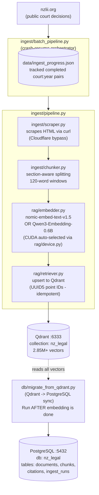
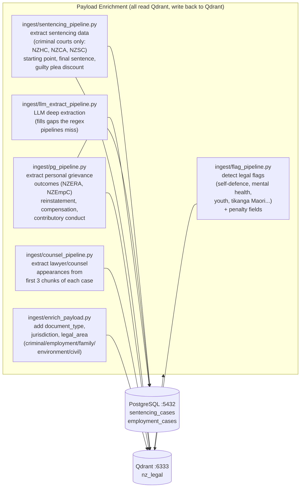
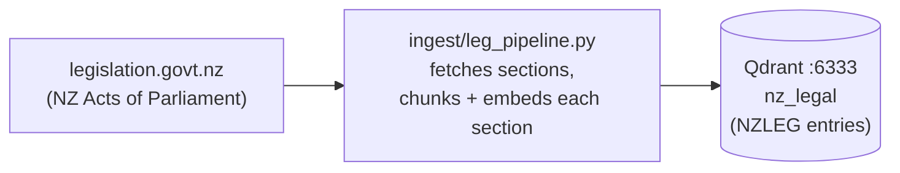
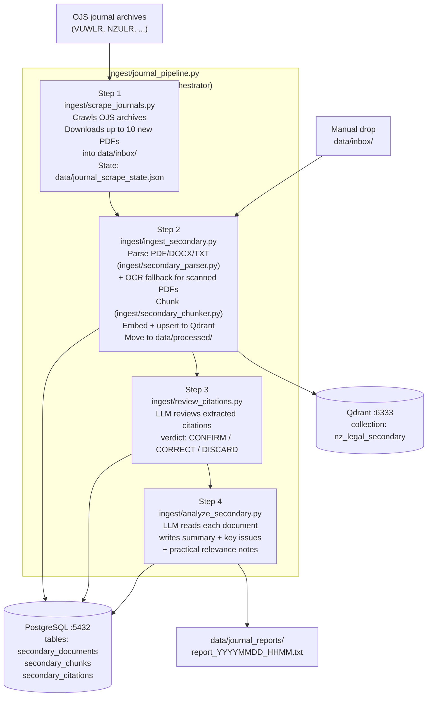
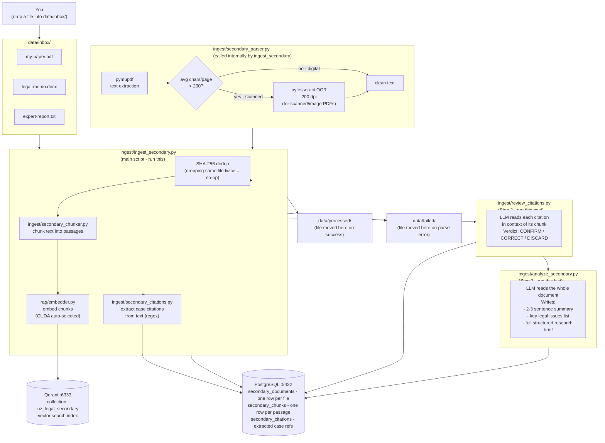
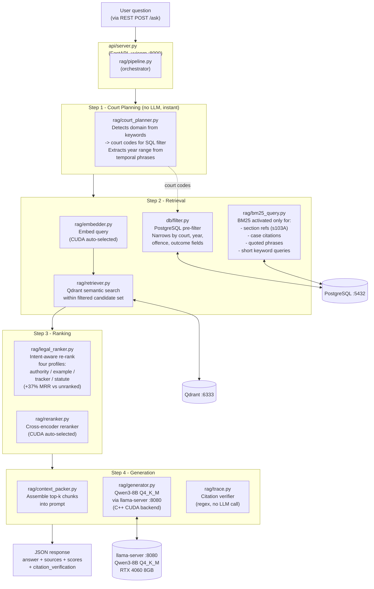

# NZ Legal RAG - Pipeline & Script Reference

Everything that moves data through this system, explained step by step.
Start here if you are lost. Read top to bottom.

---

## Table of Contents

1. [Big Picture](#1-big-picture)
2. [Ingestion Pipeline A - Court Decisions](#2-ingestion-pipeline-a---court-decisions-nzlii)
3. [Ingestion Pipeline B - Payload Enrichment](#3-ingestion-pipeline-b---payload-enrichment)
4. [Ingestion Pipeline C - Legislation](#4-ingestion-pipeline-c---legislation)
5. [Ingestion Pipeline D - Secondary Sources (Journals, automated)](#5-ingestion-pipeline-d---secondary-sources-journals-automated)
6. [Ingestion Pipeline E - Manual PDF/Document Ingestion](#6-ingestion-pipeline-e---manual-pdfdocument-ingestion)
7. [Query Pipeline](#7-query-pipeline)
8. [Database Schema Overview](#8-database-schema-overview)
9. [Systemd Services](#9-systemd-services)
10. [Runbook - First-Time Setup](#10-runbook---first-time-setup-order-matters)
11. [Runbook - Adding a New Year](#11-runbook---adding-a-new-year-of-decisions)
12. [Script Reference Table](#12-script-reference-table)

---

## 1. Big Picture

There are two completely separate flows:

```
+-------------------+       +------------------+
|  INGESTION        |       |  QUERY           |
|  (offline batch)  |       |  (live, per-req) |
|                   |       |                  |
|  NZLII scrape     |       |  User question   |
|    -> Qdrant      |       |    -> court plan  |
|    -> PostgreSQL  |       |    -> embed       |
|                   |       |    -> search      |
|  Journals/PDFs    |       |    -> rank        |
|    -> Qdrant      |       |    -> LLM answer  |
|    -> PostgreSQL  |       |    -> API resp    |
+-------------------+       +------------------+
         |                           |
         v                           v
  [Qdrant :6333]           [llama-server :8080]
  [PostgreSQL :5432]       served by [API :8000]
```

**Qdrant** holds all the vector embeddings and chunk payloads (the fast search index).
**PostgreSQL** holds relational metadata (court, year, structured fields) for SQL pre-filtering
and the structured trackers (sentencing, PG outcomes).
**Both must be populated** for full functionality. Qdrant is populated by the
scrape/embed pipeline. PostgreSQL is populated by `db/migrate_from_qdrant.py`
(for historical data) and by `ingest/ingest_secondary.py` (for secondary sources directly).

---

## 2. Ingestion Pipeline A - Court Decisions (NZLII)

This is the main pipeline that brings in all NZ court decisions from NZLII.

### Flow Diagram



### Step by Step

**Step 1 - Run the batch pipeline** (handles one or many court/year combinations):

```bash
# Single court, all years from recommended start to current
python -m ingest.batch_pipeline --courts NZCA --year-from 1985 --year-to 2026

# Multiple courts at once
python -m ingest.batch_pipeline --courts NZSC NZERA NZEmpC --year-from 2000 --year-to 2026

# Check what is done vs pending without running
python -m ingest.batch_pipeline --status --courts NZCA --year-from 1985 --year-to 2026

# Dry run - show what WOULD be ingested
python -m ingest.batch_pipeline --courts NZHC --year-from 2000 --year-to 2026 --dry-run
```

The batch pipeline skips any (court, year) pair already in `data/ingest_progress.json`.
Re-running is safe - Qdrant upserts are idempotent because point IDs are UUID5 hashes.

**Step 2 - Sync to PostgreSQL** (run after batch pipeline finishes or at any time):

```bash
# Full sync - reads all Qdrant vectors, writes to PostgreSQL
python -m db.migrate_from_qdrant

# Single court only (faster)
python -m db.migrate_from_qdrant --court NZHC

# Dry run - scan without writing
python -m db.migrate_from_qdrant --dry-run
```

Also run this command when you forget to run it after a batch. Completely safe to re-run.

### Recommended Start Years Per Court

| Court   | From | Notes                              |
|---------|------|------------------------------------|
| NZCA    | 1985 | Full history available on NZLII    |
| NZSC    | 2004 | Court only exists from 2004        |
| NZHC    | 2000 | Earlier records sparse on NZLII    |
| NZEmpC  | 2000 |                                    |
| NZERA   | 2000 |                                    |
| NZFC    | 2000 |                                    |
| NZEnvC  | 1996 |                                    |
| NZACC   | 2000 |                                    |
| NZCorC  | 2000 |                                    |
| NZLCDT  | 2000 |                                    |
| NZHRRT  | 2000 |                                    |
| NZREADT | 2000 |                                    |
| NZTT    | 2021 | Only available on NZLII from 2021  |

### How the Scraper Works (and why curl)

NZLII is behind Cloudflare. Python `httpx`/`requests` get blocked because of TLS
fingerprinting. `ingest/scraper.py` shells out to system `curl`, which uses the OS
libcurl with a browser-compatible TLS fingerprint and gets through fine.

URL pattern: `https://www.nzlii.org/nz/cases/{COURT}/{YEAR}/{N}.html`

The scraper increments N from 1 until it gets enough consecutive 404s to declare
the year exhausted.

---

## 3. Ingestion Pipeline B - Payload Enrichment

After decisions are in Qdrant, these scripts add extra structured metadata to
each chunk's payload. They read from Qdrant and write back to Qdrant (no re-embedding).
Run them in any order - they are all idempotent.

### Flow Diagram



### Commands

```bash
# Flags + penalty on all chunks (run this first)
python -m ingest.flag_pipeline

# Sentencing fields on NZHC/NZCA/NZSC chunks
python -m ingest.sentencing_pipeline

# Personal grievance outcomes on NZERA/NZEmpC chunks
python -m ingest.pg_pipeline

# Counsel/lawyer names on all chunks
python -m ingest.counsel_pipeline

# document_type, jurisdiction, legal_area metadata
python -m ingest.enrich_payload

# LLM deep extraction (run last, needs LLM server running)
python -m ingest.llm_extract_pipeline --domain employment
python -m ingest.llm_extract_pipeline --domain criminal
```

All support `--dry-run` and `--batch-size`.

---

## 4. Ingestion Pipeline C - Legislation

NZ Acts of Parliament from legislation.govt.nz. Each Act section becomes
one or more chunks, indexed alongside court decisions so queries about
specific statutory sections can retrieve the actual text.



```bash
# Specific Acts
python -m ingest.leg_pipeline --acts RTA ERA2000 PA2020

# All configured Acts (default)
python -m ingest.leg_pipeline
```

---

## 5. Ingestion Pipeline D - Secondary Sources (Journals, automated)

Academic journal articles, legal memos, and PDFs. These go into a **separate**
Qdrant collection (`nz_legal_secondary`) and their own PostgreSQL tables.

### Flow Diagram



### Commands

```bash
# Run the full pipeline manually (recommended for first run)
python -m ingest.journal_pipeline

# Limit to 5 new PDFs this run
python -m ingest.journal_pipeline --limit 5

# Dry run - show what would be fetched, no downloads
python -m ingest.journal_pipeline --dry-run

# Drop a PDF manually into inbox and ingest it directly (skip scrape step)
cp my-paper.pdf data/inbox/
python -m ingest.ingest_secondary

# Check pipeline status (doc counts at each stage)
python -m ingest.pipeline_status
```

### Automated Timer (systemd)

The journal pipeline runs every 12 hours via systemd. It is **stopped by default**
so you can run it manually first. Enable it when you are happy with the results:

```bash
# Check status
systemctl --user status nz-legal-journal.timer

# Enable (starts automatically every 12h)
systemctl --user enable --now nz-legal-journal.timer

# Disable (manual control only)
systemctl --user disable --now nz-legal-journal.timer

# Run once now
systemctl --user start nz-legal-journal.service
```

---

## 6. Ingestion Pipeline E - Manual PDF/Document Ingestion

Use this when you have a specific document you want to add to the secondary
knowledge base: a legal memo, a court judgment in PDF form, a law review article,
an expert report, anything. You drop the file and run three commands.

**This is a separate collection from primary court decisions.** Your PDF goes
into `nz_legal_secondary`, NOT into the main `nz_legal` collection. The RAG
pipeline searches both collections and merges results.

### What file formats are supported?

| Format | How it is parsed |
|---|---|
| `.pdf` | pymupdf text extraction. If the page has fewer than 200 chars on average (scanned/image PDF), falls back to OCR via pytesseract at 200 dpi. |
| `.docx` / `.doc` | python-docx paragraph extraction |
| `.txt` | read as-is |
| `.md` | read as-is |

### Flow Diagram



### Step by Step - Adding a Document Manually

**Step 1 - Drop the file into the inbox:**

```bash
cp /path/to/my-document.pdf data/inbox/
# or for multiple files
cp /path/to/*.pdf data/inbox/
```

**Step 2 - Run the ingestion script:**

```bash
python -m ingest.ingest_secondary
```

This script will:
- Parse every file in `data/inbox/` (text extraction + OCR fallback)
- Chunk each document into passages
- Embed all passages (GPU if available)
- Upsert into the `nz_legal_secondary` Qdrant collection
- Record metadata in PostgreSQL (`secondary_documents`, `secondary_chunks`)
- Extract case citations using regex
- Move successfully processed files to `data/processed/`
- Move failed files to `data/failed/` (check there if something goes wrong)

You can also specify a source type label and a single file:

```bash
# Tag the document type
python -m ingest.ingest_secondary --source-type legal_memo
python -m ingest.ingest_secondary --source-type journal_article
python -m ingest.ingest_secondary --source-type expert_report

# Ingest a single specific file (skips inbox scan)
python -m ingest.ingest_secondary --file data/inbox/my-paper.pdf --source-type legal_memo
```

**Step 3 - LLM citation review** (needs llama-server running):

```bash
python -m ingest.review_citations
```

This reads all extracted citations that are flagged `pending_llm`, asks the LLM
whether each citation is real or a false positive, and marks them
`llm_confirmed`, `llm_corrected`, or `discarded`. Run this to clean up the
citation graph.

**Step 4 - LLM document analysis** (needs llama-server running):

```bash
python -m ingest.analyze_secondary
```

This reads each document that has not been analysed yet, asks the LLM for a
structured research brief (summary, key legal issues, relevant cases, practical
notes), and stores the result in `secondary_documents.analysis_text`. After this
step, the `/ask` endpoint can summarise and cite the document in its answers.

**Check what was ingested:**

```bash
python -m ingest.pipeline_status
```

Output looks like:

```
secondary_documents: 10 total
  embedded:  10  (ready for search)
  pending:    0
  failed:     0
secondary_citations: 47 total
  auto_accepted:  12  (high-confidence regex match)
  pending_llm:     8  (waiting for review step)
  llm_confirmed:  19
  llm_corrected:   5
  discarded:       3
```

### What Happens if a PDF is Scanned (image-only)?

`secondary_parser.py` automatically detects this. If the average character count
per page after pymupdf extraction is under 200, it switches to OCR mode:

```
pymupdf extracts:  "    " (blank page - scanned)
                          -> avg 32 chars/page < 200 threshold
                          -> switching to pytesseract OCR at 200 dpi
OCR extracts:      "The parties agreed that the tenancy commenced..."
                          -> 4 chunks -> 101 chunks
```

No action needed from you. It just works. Requires `tesseract` system package
and `pytesseract` Python package to be installed.

### Troubleshooting

| Symptom | Check |
|---|---|
| File ends up in `data/failed/` | Run `python -m ingest.ingest_secondary --file data/failed/myfile.pdf` and read the error output |
| 0 chunks extracted | PDF may be encrypted or corrupt. Try `pdfinfo myfile.pdf` to check. |
| Citations not linking to corpus | Run review step: `python -m ingest.review_citations` |
| Document not appearing in search results | Check `python -m ingest.pipeline_status` - if embedded count went up, it is in Qdrant and should be searchable |
| OCR output is garbage | Check tesseract language pack: `tesseract --list-langs` should include `eng` |

---

## 7. Query Pipeline

This runs on every user request. All components are loaded into memory once
at API startup and reused.

### Flow Diagram



### REST Endpoints

| Endpoint | Method | Description |
|---|---|---|
| `GET /` | GET | Web UI (index.html) |
| `POST /ask` | POST | Full RAG: question -> answer with citations |
| `GET /search` | GET | Semantic search only, no LLM generation |
| `POST /notable` | POST | Filter notable cases by flags + penalty |
| `POST /sentencing-tracker` | POST | Criminal sentencing data filtered search |
| `POST /pg-tracker` | POST | Personal grievance outcome filtered search |
| `POST /contrasting-cases` | POST | Find cases with opposite outcomes |
| `GET /health` | GET | Probe Qdrant, PostgreSQL, LLM, embedder |

---

## 8. Database Schema Overview

### Qdrant (vector store, port 6333)

| Collection | Contents | Vectors |
|---|---|---|
| `nz_legal` | All court decisions + legislation chunks | 2.85M+ |
| `nz_legal_secondary` | Journal articles, legal memos | growing |

Each Qdrant point payload includes: `case_id`, `court`, `year`, `title`, `date`,
`url`, `text`, `chunk_index`, `section_heading`, `citations[]`, `flags[]`,
`penalty{}`, `sentencing{}`, `pg{}`, `counsel{}`.

### PostgreSQL (relational store, port 5432, db: nz_legal)

```
documents          - one row per case (title, citation, court, date, url)
chunks             - one row per chunk (text, chunk_index, qdrant_point_id)
citations          - citation strings extracted at ingest time
ingest_runs        - one row per (court, year) batch completed
judges             - judge names extracted from decisions
document_judges    - many-to-many: documents <-> judges
legislation_refs   - statutes referenced by each decision
sentencing_cases   - structured criminal sentencing fields
employment_cases   - structured PG grievance + outcome fields
courts             - court metadata (full name, jurisdiction)
evaluation_results - benchmark query results (MRR, Hit@K)

secondary_documents   - secondary source metadata + LLM analysis
secondary_chunks      - secondary source text chunks
secondary_citations   - citations found in secondary sources
```

---

## 9. Systemd Services

All services run as **user-level** (`--user`), not system-level.

```
~/.config/systemd/user/
  nz-legal-api.service      - uvicorn API on port 8000
  nz-legal-tunnel.service   - Cloudflare tunnel (depends on API)
  llama-server.service      - llama.cpp GPU inference on port 8080
  nz-legal-journal.service  - journal pipeline (one-shot, called by timer)
  nz-legal-journal.timer    - runs journal.service every 12h
```

### Common Commands

```bash
# Status of everything
systemctl --user status nz-legal-api nz-legal-tunnel llama-server

# Start/stop individual services
systemctl --user start  nz-legal-api
systemctl --user stop   llama-server    # free GPU for batch ingestion
systemctl --user restart nz-legal-api

# View live logs
journalctl --user -u nz-legal-api -f
journalctl --user -u llama-server -f

# Enable a service to start on login
systemctl --user enable nz-legal-api
```

**Important:** `llama-server` uses ~6.6 GB VRAM. Stop it before running large
batch ingestion jobs so the embedder gets the full GPU.

---

## 10. Runbook - First-Time Setup (order matters)

Run these steps in order once when setting up on a fresh machine.

```bash
# 1. Install dependencies
pip install -e .

# 2. Create PostgreSQL database and schema
createdb nz_legal
psql -d nz_legal -f db/schema.sql

# 3. Start Qdrant (Docker)
docker-compose up -d qdrant

# 4. Start llama-server (GPU inference)
systemctl --user start llama-server

# 5. Ingest court decisions - start with NZCA as a smoke test
python -m ingest.batch_pipeline --courts NZCA --year-from 2023 --year-to 2024

# 6. Sync to PostgreSQL
python -m db.migrate_from_qdrant

# 7. Enrich payloads
python -m ingest.flag_pipeline
python -m ingest.sentencing_pipeline
python -m ingest.pg_pipeline
python -m ingest.counsel_pipeline
python -m ingest.enrich_payload

# 8. Start the API
systemctl --user start nz-legal-api

# 9. Test it
curl http://localhost:8000/health

# 10. Full historical backfill (long-running - run in background)
nohup python -m ingest.batch_pipeline \
  --courts NZCA NZSC NZHC NZEmpC NZERA NZFC NZEnvC NZACC NZCorC \
           NZLCDT NZHRRT NZREADT \
  --year-from 2000 --year-to 2026 \
  > data/backfill.log 2>&1 &

# 11. After backfill finishes - sync again
python -m db.migrate_from_qdrant

# 12. Add legislation
python -m ingest.leg_pipeline

# 13. Start public tunnel (optional)
systemctl --user start nz-legal-tunnel
```

---

## 11. Runbook - Adding a New Year of Decisions

Do this annually (or more often) to stay current.

```bash
# 1. Stop LLM server to free GPU for embedding
systemctl --user stop llama-server

# 2. Scrape and embed new year for all courts
python -m ingest.batch_pipeline \
  --courts NZCA NZSC NZHC NZEmpC NZERA NZFC NZEnvC NZACC NZCorC \
           NZLCDT NZHRRT NZREADT NZTT \
  --year-from 2026 --year-to 2026

# 3. Sync to PostgreSQL
python -m db.migrate_from_qdrant

# 4. Re-run enrichment pipelines (picks up new chunks only)
python -m ingest.flag_pipeline
python -m ingest.sentencing_pipeline
python -m ingest.pg_pipeline
python -m ingest.counsel_pipeline

# 5. Restart LLM server
systemctl --user start llama-server
```

---

## 12. Script Reference Table

### Ingestion Scripts (`ingest/`)

| Script | What it does | Reads from | Writes to |
|---|---|---|---|
| `batch_pipeline.py` | Crash-resume orchestrator for all court/year pairs | NZLII (via pipeline.py) | Qdrant, `data/ingest_progress.json` |
| `pipeline.py` | Per-year worker: scrape -> chunk -> embed -> upsert | NZLII | Qdrant |
| `scraper.py` | curl-based NZLII HTML scraper (Cloudflare bypass) | nzlii.org | memory |
| `chunker.py` | Section-aware 120-word chunker for legal decisions | memory | memory |
| `flag_pipeline.py` | Detect flags (self-defence, youth, tikanga, ...) + penalty | Qdrant | Qdrant |
| `sentencing_pipeline.py` | Extract sentencing fields (criminal courts only) | Qdrant | Qdrant, PostgreSQL sentencing_cases |
| `pg_pipeline.py` | Extract personal grievance outcomes (NZERA, NZEmpC) | Qdrant | Qdrant, PostgreSQL employment_cases |
| `counsel_pipeline.py` | Extract counsel/lawyer names from appearances block | Qdrant | Qdrant |
| `enrich_payload.py` | Add document_type, jurisdiction, legal_area to all chunks | Qdrant | Qdrant |
| `llm_extract_pipeline.py` | LLM deep extraction for fields regex missed | PostgreSQL + Qdrant | PostgreSQL |
| `leg_pipeline.py` | Scrape NZ Acts from legislation.govt.nz | legislation.govt.nz | Qdrant |
| `scrape_journals.py` | Crawl OJS archives, download new PDFs to inbox | OJS archives | `data/inbox/`, `data/journal_scrape_state.json` |
| `journal_pipeline.py` | 12h orchestrator: scrape -> ingest -> review -> analyse | OJS archives | Qdrant, PostgreSQL, `data/journal_reports/` |
| `ingest_secondary.py` | Parse/chunk/embed secondary sources from inbox | `data/inbox/` | Qdrant `nz_legal_secondary`, PostgreSQL secondary_* |
| `secondary_parser.py` | PDF/DOCX/TXT parser with OCR fallback (pytesseract) | file | memory |
| `secondary_chunker.py` | Chunker for secondary source text | memory | memory |
| `review_citations.py` | LLM review: CONFIRM / CORRECT / DISCARD citations | PostgreSQL secondary_citations | PostgreSQL secondary_citations |
| `analyze_secondary.py` | LLM document analysis: summary + key issues + brief | PostgreSQL secondary_documents | PostgreSQL secondary_documents |
| `pipeline_status.py` | Print counts at each stage of the secondary pipeline | PostgreSQL | stdout |

### Database Scripts (`db/`)

| Script | What it does | Reads from | Writes to |
|---|---|---|---|
| `migrate_from_qdrant.py` | Full Qdrant -> PostgreSQL sync. Run after every batch ingest. | Qdrant (all vectors) | PostgreSQL documents, chunks, citations, ingest_runs, sentencing_cases, employment_cases |
| `filter.py` | SQL pre-filter + BM25 helpers used by the query pipeline | PostgreSQL | memory (results) |

### RAG / Query Scripts (`rag/`)

| Script | What it does |
|---|---|
| `pipeline.py` | Main query orchestrator - calls all components below in order |
| `court_planner.py` | Heuristic keyword -> court codes (no LLM, instant) |
| `device.py` | GPU auto-selection: `select_device(min_vram_mb=512)` - used by embedder and reranker |
| `embedder.py` | Sentence-transformer embedding (CUDA auto via device.py) |
| `retriever.py` | Qdrant search and upsert wrapper |
| `bm25_query.py` | BM25 activation logic + OR-query builder |
| `legal_ranker.py` | Intent-aware re-ranker (authority / example / tracker / statute profiles) |
| `reranker.py` | Cross-encoder reranker (CUDA auto via device.py) |
| `context_packer.py` | Assemble chunks into LLM prompt, respecting token budget |
| `generator.py` | Call llama-server (OpenAI-compatible API, Qwen3-8B Q4_K_M) |
| `trace.py` | Citation verifier (regex match against retrieved sources, no LLM) |
| `contrasting.py` | Find cases with opposite outcomes for same fact pattern |

### API

| Script | What it does |
|---|---|
| `api/server.py` | FastAPI app with all REST endpoints. Serves static UI from `api/static/`. |

---

## Useful One-Liners

```bash
# How many vectors in Qdrant?
python3 -c "from qdrant_client import QdrantClient; import config; q=QdrantClient(url=config.QDRANT_URL); print(q.get_collection(config.QDRANT_COLLECTION).points_count)"

# Court coverage in PostgreSQL
psql -d nz_legal -c "SELECT court, COUNT(*) docs, MIN(EXTRACT(YEAR FROM decision_date))::int earliest, MAX(EXTRACT(YEAR FROM decision_date))::int latest FROM documents WHERE decision_date IS NOT NULL GROUP BY court ORDER BY court;"

# Which court/year batches are done?
python -m ingest.batch_pipeline --status --courts NZCA NZHC NZSC --year-from 1985 --year-to 2026

# Secondary pipeline status
python -m ingest.pipeline_status

# Health check (all services)
curl -s http://localhost:8000/health | python3 -m json.tool

# Watch backfill log live
tail -f data/scrape_nztt.log
tail -f data/backfill_queue.log
```
